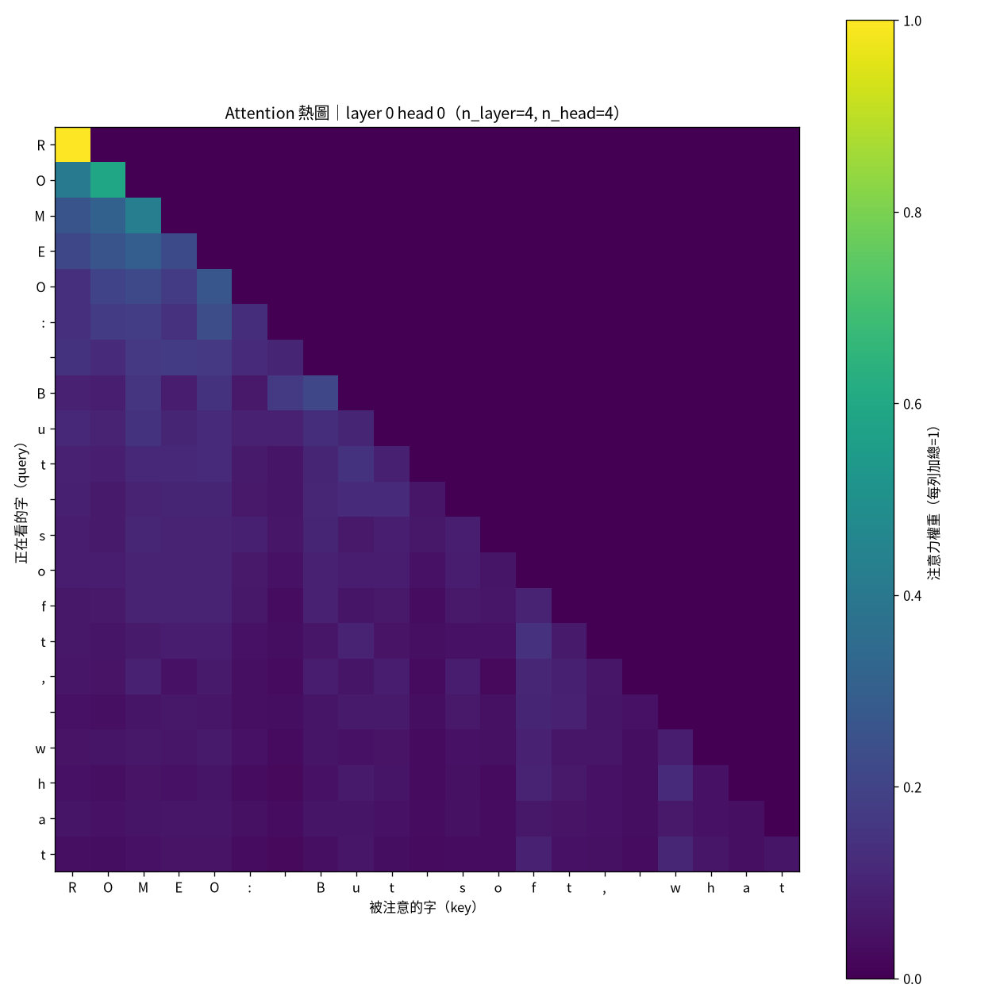
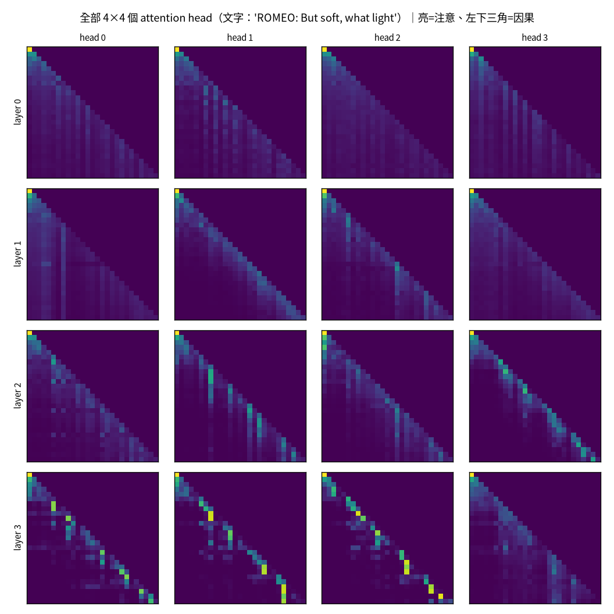

# 最小的 GPT：從 attention 到自回歸 {#sec-minimal-gpt}

> **一句話**：一個 GPT 的核心只有一件事——*給定前面的字，預測下一個字*。
> 而讓它「看上下文」的機制，self-attention，其實可以想成一個模糊版的 `HashMap.get()`。

```{mermaid}
%%| fig-cap: "你在這裡：地基的第一步——把最小 GPT 從零刻出來。"
flowchart LR
  A["01 GPT"]-->B["02 零件"]-->C["03 效率"]-->D["04 資料"]-->E["05 評估"]-->F["06 服務"]-->G["07 治理"]-->H["08 漂移"]
  E -.後訓練.-> I["09 對齊"]
  classDef here fill:#c0392b,color:#fff,stroke:#7b241c,stroke-width:2px;
  class A here
```

::: {.callout-note}
## 這章的定位（讀之前先對齊期待）
**假設你已經會**：Python、基本線性代數（矩陣相乘、向量內積）、知道什麼是「神經網路用梯度下降訓練」。
**不需要**：任何 NLP / Transformer 背景。

**學完你會**：(1) 用一句 `softmax(QKᵀ/√d)V` 解釋 self-attention，並逐行把它建起來；
(2) 講清楚那個不起眼的 $\sqrt{d}$ 為什麼非有不可；(3) 在**你自己的筆電 CPU 上**，
從零訓練一個小 GPT、親眼看它從亂碼長成「像英文的假莎士比亞」。全章的程式碼都**完整內嵌**，
不 clone 任何 repo 也讀得懂、跑得動。
:::

::: {.callout-tip collapse="true"}
## 🎯 給技術主管：本章關鍵術語速查（懂的人可跳過）
不必親手實作也能跟上——每個術語一句白話 + 為什麼你該在意。

- **token**：模型處理的最小單位（一個字或詞片段）。*在意它*：輸入輸出都以 token 計長、計價。
- **embedding（嵌入）**：把 token 變成一串數字向量。*在意它*：模型「理解」的起點，維度大小牽動容量與成本。
- **self-attention（自注意力）**：讓每個位置參考其他位置的機制（書裡比喻成「模糊的 `HashMap.get()`」）。*在意它*：Transformer 強大、也最耗算的核心。
- **softmax**：把一組分數變成總和為 1 的權重。*在意它*：模型怎麼把「分數」變成「選擇」。
- **residual（殘差連接）**：`x = x + f(x)` 的捷徑。*在意它*：能不能把網路疊深、還訓得動的關鍵。
- **next-token 目標**：訓練就是「猜下一個字」。*在意它*：整個 LLM 的能力都長自這一個荒謬簡單的目標。
:::

## self-attention 是「模糊的 HashMap.get()」

Java 工程師對 `HashMap.get(key)` 很熟：拿一個 key 去比對、命中就回傳對應的 value。
self-attention 做的是一個**模糊**版：每個位置產生一個 query，去跟所有位置的 key 算相似度，
**不是只取一個**，而是用相似度當權重，把所有 value 加權平均回來。

$$
\text{Attention}(Q,K,V)=\operatorname{softmax}\!\Big(\frac{QK^\top}{\sqrt{d}}\Big)V
$$

| HashMap.get(key) | self-attention |
|---|---|
| 一個 key | 一個 query（由當前 token 投影出來）|
| 精確比對（equals/hashCode）| 點積算「相似度」，越像分數越高 |
| 命中**一個** value | softmax 加權，**所有** value 都按相似度貢獻一點 |
| 回傳那個 value | 回傳加權平均後的新向量 |

「模糊」就在第三行：HashMap 是 hard 命中一個，attention 是 soft 地把全部混進來。

## 逐行把一個 attention head 建起來 {#sec-build-attention}

直接看公式容易糊。我們從一個**空殼**開始，一步一步把上面那條式子填出來——這就是
本章配套程式 `tiny_gpt.py` 裡 `Head` 類別的 `forward`，逐行拆給你看。

輸入 `x` 的形狀是 `(B, T, C)`：B 個句子、每句 T 個 token、每個 token 是 C 維向量。

**第 0 步——投影出 query / key / value。** 同一個 `x`，過三個各自獨立的線性層，
得到三個視角。直覺：key 是「我這個位置能提供什麼」、query 是「我這個位置在找什麼」、
value 是「真的被取走時我給出的內容」。

```python
q = self.query(x)   # (B, T, hd)　我在找什麼
k = self.key(x)     # (B, T, hd)　我能提供什麼
v = self.value(x)   # (B, T, hd)　真被取走時我給的內容
```

**第 1 步——算相似度（`q @ kᵀ`）。** 讓每個位置的 query 去跟**每個**位置的 key 做點積。
結果是一張 `T×T` 的分數表：`att[i, j]` = 第 i 個 token 對第 j 個 token 的「在意程度」。

```python
att = q @ k.transpose(-2, -1)        # (B, T, T)
```

**第 2 步——除以 $\sqrt{d}$。** 點積會隨維度變大而尺度暴衝，把 softmax 推進飽和區
（下一節用變異數論證為什麼）。先除以 $\sqrt{d}$ 把尺度壓回來：

```python
att = att / math.sqrt(k.shape[-1])   # (B, T, T)，尺度正規化
```

**第 3 步——因果遮罩（不能偷看未來）。** 我們在做「預測下一個字」，第 i 個位置只准看
$\le i$ 的位置。把上三角（未來）填成 $-\infty$，等一下 softmax 後就會變 0：

```python
att = att.masked_fill(self.tril[:T, :T] == 0, float("-inf"))
```

**第 4 步——softmax 轉成權重。** 把每一列分數轉成一組「和為 1」的權重。
被填 $-\infty$ 的未來位置 $e^{-\infty}=0$，自動拿到 0 權重：

```python
att = F.softmax(att, dim=-1)         # (B, T, T)，每列和為 1
```

**第 5 步——加權平均 value。** 用權重把所有位置的 value 混起來，得到每個位置的新表示：

```python
out = att @ v                        # (B, T, hd)
```

把這六步拼起來，就是一個完整的 attention head——和那條數學式一字不差：

```python
class Head(nn.Module):
    """單一 attention head：softmax(QKᵀ/√d)V 的直接翻譯。"""

    def __init__(self, head_dim):
        super().__init__()
        self.key   = nn.Linear(n_embd, head_dim, bias=False)
        self.query = nn.Linear(n_embd, head_dim, bias=False)
        self.value = nn.Linear(n_embd, head_dim, bias=False)
        self.register_buffer("tril", torch.tril(torch.ones(block_size, block_size)))

    def forward(self, x):
        B, T, C = x.shape
        q, k, v = self.query(x), self.key(x), self.value(x)
        att = q @ k.transpose(-2, -1) / math.sqrt(k.shape[-1])         # 相似度 + 縮放
        att = att.masked_fill(self.tril[:T, :T] == 0, float("-inf"))    # 因果遮罩
        att = F.softmax(att, dim=-1)                                    # 轉權重
        return att @ v                                                 # 加權平均 value
```

::: {.callout-note}
## 為什麼要「加權平均」而不是「取最像的那一個」
取最像的一個（hard attention）不可微，沒法用梯度下降訓練。softmax 的加權平均是個*可微的*
近似——這也是為什麼深度學習裡到處是 softmax：它把「選擇」變成「平滑、可訓練」的版本。
:::

「multi-head」只是把上面這顆 head 平行擺 `n_head` 顆（各自有獨立的 q/k/v 投影、各看一個子空間），
最後把輸出 `concat` 起來再投影回去。專案正式版（`src/model.py`）為了效率把多頭塞進一次矩陣乘，
數學上和「`n_head` 顆 `Head` 併排」完全一樣。

## 為什麼要除以 $\sqrt{d}$ {#sec-sqrt-d}

這個不起眼的 $\sqrt{d}$ 有它的道理。假設 $q,k\in\mathbb{R}^d$ 各維獨立、零均值單位變異，
那麼點積 $q\cdot k=\sum_{i=1}^d q_i k_i$ 的變異數是：

$$
\operatorname{Var}(q\cdot k)=\sum_{i=1}^d \operatorname{Var}(q_i k_i)=d.
$$

也就是說標準差約 $\sqrt{d}$。維度 $d$ 一大，點積的尺度就跟著放大，softmax 會被推進「幾乎 one-hot」
的飽和區，梯度趨近 0、訓練停滯。除以 $\sqrt{d}$ 把變異數正規化回 1，讓 softmax 不管維度多大都待在
有梯度的區間。

## 親眼看 attention 在看哪裡

把訓練好的模型某一層某一個 head 的 attention 權重畫成熱圖，因果結構一目了然：

{#fig-attention width=70%}

@fig-attention 的下三角形是因果遮罩的直接後果。把所有 head 攤開看（@fig-attention-grid），
會發現不同 head 有不同分工——早層糊而廣、深層尖而準。

{#fig-attention-grid width=90%}

## 從一個 block 到一個 GPT

一個 Transformer block 把 attention 和一個小 MLP 疊起來，各自帶一條 **residual connection**
（`x = x + f(x)`）。residual 不是裝飾，是承重牆：

::: {.callout-warning}
## residual 是承重牆，不是裝飾
我做過一個實驗：把 `model.py` 裡的 `x + ` 拿掉、其他不變。結果 val loss 卡在 3.36（≈亂猜），
有 residual 才掉到 1.77。沒有它，深層網路的梯度會消失、根本訓不動。ResNet 在 2015 年就是用它
解鎖了「疊很深」。
:::

把 $N$ 個 block 疊起來、前面接 token embedding、後面接一個線性層輸出每個字的機率，就是一個
decoder-only GPT。訓練目標單純到不可思議——就是「預測下一個 token」的 cross-entropy（見 @sec-eval）。

## 💻 在你的機器上：純 CPU 訓出一個會「假裝莎士比亞」的 GPT {#sec-tiny-gpt}

光看不練不算懂。這一節給你一支**完全自包含**的 char-level GPT：把上面所有零件（`Head`、
multi-head、residual block、token+pos embedding）組起來，在**純 CPU**、一份 1.1 MB 的莎士比亞
文本上，從零訓練。**不需要 GPU、不需要 clone 任何 repo。**

抓語料、開跑：

```bash
# 1) 抓 1.1 MB 的莎士比亞（Karpathy 的 tinyshakespeare）
curl -o input.txt https://raw.githubusercontent.com/karpathy/char-rnn/master/data/tinyshakespeare/input.txt
# 2) 純 CPU 訓練（完整程式見本書 examples/tiny_gpt.py）
python tiny_gpt.py
```

模型只有約 0.6M 參數、3 層、context 64 字。訓練迴圈就是課本最樸素的那一段——
取一個 batch、算 loss、`backward`、`step`：

```python
opt = torch.optim.AdamW(model.parameters(), lr=3e-3)
for it in range(max_iters + 1):
    if it % eval_every == 0:
        l = estimate_loss(model)
        print(f"step {it:>4}: train {l['train']:.3f}  val {l['val']:.3f}")
    x, y = get_batch("train")     # y 就是 x 右移一格＝「下一個字」
    _, loss = model(x, y)         # cross-entropy
    opt.zero_grad(set_to_none=True)
    loss.backward()
    opt.step()
```

在我的 Framework 16（純 CPU、8 執行緒，整段約 1 分 50 秒）上，loss 這樣往下掉：

```
step    0: train 4.338  val 4.341
step  500: train 1.744  val 1.899
step 1000: train 1.550  val 1.756
step 1500: train 1.490  val 1.670
step 2000: train 1.446  val 1.637
step 2500: train 1.417  val 1.615
step 3000: train 1.384  val 1.589
```

**怎麼讀這條曲線**：loss 是「預測下一個字的平均 cross-entropy（單位 nat）」。
一開始 vocab 有 65 個字元，亂猜的 loss ≈ $\ln 65 \approx 4.17$——所以起手 loss 量到 4.34 正是「完全不會」。
掉到 1.59 代表模型把「下一個字」的不確定性壓掉了一大半（見 @sec-eval 對 loss/BPC 的解讀）。
注意 train（1.38）已經低於 val（1.59）一截——這個小模型開始輕微 overfit，正好預告了
@sec-eval 要談的「為什麼要分 train/val」。

**親眼見證——同一個模型，訓練前 vs 訓練後**。從一個換行字元起手，讓它自回歸吐 400 個字：

::: {.callout-note}
## 訓練前（隨機初始化，step 0）
亂碼，連 word 都不是、標點亂撒、大小寫亂跳：

```
nrDa,xU:Hlkp!O.yn,s-;AHwEQntdy!D
gu?Ncn
!rllopqAQjYvfIMEu,OaHQdrKU;ta  NdTl-pHU&$zMtoACYsfM-qjft&khyuscpImrJQ!kPAmyOYL
```
:::

::: {.callout-tip}
## 訓練後（step 3000）
還不是真英文，但**它顯然學到了莎士比亞劇本的形狀**——大寫角色名 + 冒號 + 對白、
換行、像樣的詞長分佈：

```
Sethink the town of the Bucking about and his sommand.

KING RICHARD II:
Without thy word, men.

JULIET:
A case that can show me on, there I cuse of God
Womenger's youth in from the dares he like
To you-hood, and allikely
courted my uneousoder soul by Angel:
And that he his hencdle, sir.
```
:::

它沒有背下任何句子（這些「字」多半不存在於原文），卻學到了拼字、換行、`角色名:` 的格式——
**全部只靠「預測下一個字」這一個目標**。這就是整本書要放大的那件事：把一個荒謬簡單的目標
做到極致，結構會自己長出來。

## 帶走什麼

- self-attention = 模糊的 `HashMap.get()`：query 對所有 key 算相似度 → softmax → 加權平均 value，
  六行就能逐行建起來（@sec-build-attention）。
- $\sqrt{d}$ 縮放是為了讓 softmax 不飽和——一個用變異數論證就能推出來的小細節。
- residual 是讓深層網路訓得動的承重牆，不是可有可無。
- 整個 GPT 的訓練目標就一句話：給前文、預測下一字。你已經在自己的 CPU 上親眼驗證過它會 work。

## 練習 {#sec-ch1-exercises}

::: {.callout-note}
## 1（先預測）：拿掉 $\sqrt{d}$ 會怎樣？
在 `tiny_gpt.py` 的 `Head.forward` 裡，把 `/ math.sqrt(k.shape[-1])` 刪掉再訓練。
**先寫下你的預測**：loss 曲線會怎麼變？為什麼？

::: {.callout-tip collapse="true"}
## 參考答案
point 多半變慢、甚至卡住。少了縮放，`n_embd/n_head=32` 維的點積標準差約 $\sqrt{32}\approx5.7$，
softmax 被推向接近 one-hot，attention 早早「定型」、梯度變小。維度越大、現象越明顯——
這正是 @sec-sqrt-d 變異數論證預測的結果。動手跑一次對照兩條曲線。
:::
:::

::: {.callout-note}
## 2（動手）：把 context 加長
把 `block_size` 從 64 改成 128，其餘不動，重訓。觀察 val loss 和生成樣本有沒有變好？
訓練變慢多少？（提示：attention 的計算量隨 T 是 $O(T^2)$。）

::: {.callout-tip collapse="true"}
## 參考答案
通常 val loss 會略降、樣本更連貫（模型能參考更遠的上文），但每步變慢——
attention 矩陣從 $64^2$ 變 $128^2$，是 4 倍。這個 $O(T^2)$ 正是 @sec-efficiency 整章要對付的痛點。
:::
:::

::: {.callout-warning}
## 3（弄壞）：拔掉 residual
把 `Block.forward` 的兩行 `x = x + ...` 改成 `x = ...`（拿掉 `x +`），重訓。

::: {.callout-tip collapse="true"}
## 參考答案
loss 會明顯卡更高、掉得更慢——和本章「residual 是承重牆」那個實驗一致（3.36 vs 1.77）。
層數越多越嚴重：沒有 residual，梯度要硬穿過每一層，深層幾乎收不到訊號。
:::
:::

::: {.callout-tip}
## 進階：看真實模型的 attention
專案 repo 裡 `make attn` 會畫出訓練好模型的 attention 熱圖（@fig-attention）。
改 `--layer/--head` 看不同 head 的分工，對照你在 `tiny_gpt.py` 裡建的那顆 `Head`。
:::
