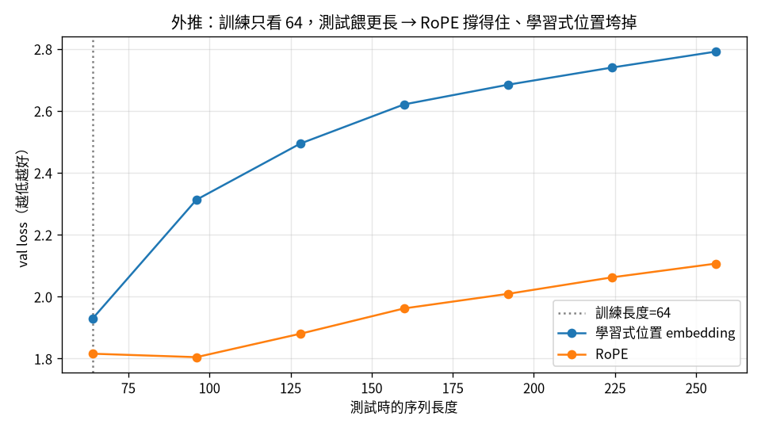

# 把它變現代：RMSNorm、SwiGLU、RoPE、GQA {#sec-modern}

> **一句話**：2017 年的原版 Transformer 和今天的 LLaMA 差在幾個可抽換的零件。
> 換之前先問一個問題——**這個零件優化的是「準」還是「省」？**——你就能事先預測對。

第 1 章我們把一個最小的 GPT 刻出來了。它能跑、能訓、能生成，但用的是 2017 年原版 Transformer
的零件。過去幾年，主流的開源模型（LLaMA、Mistral）把這些零件一個個換掉了。這一章我們也來換，
但**不是盲目換**——我把 `src/model.py` 寫成可以用設定開關一鍵切換每個零件，然後一個一個做對照實驗，
親眼看它到底有沒有用。

```{mermaid}
%%| fig-cap: "你在這裡：把最小 GPT 換上現代零件（RMSNorm/SwiGLU/RoPE/GQA）。"
flowchart LR
  A["01 GPT"]-->B["02 零件"]-->C["03 效率"]-->D["04 資料"]-->E["05 評估"]-->F["06 服務"]-->G["07 治理"]-->H["08 漂移"]
  E -.後訓練.-> I["09 對齊"]
  classDef here fill:#c0392b,color:#fff,stroke:#7b241c,stroke-width:2px;
  class B here
```

::: {.callout-note collapse="true"}
## 這章的定位（讀之前先對齊期待）
**假設你已經會**：第 1 章的最小 GPT（attention、residual、token+pos embedding、訓練迴圈）。
不需要任何「現代 LLM」背景。

**學完你會**：(1) 用一句「這零件優化的是**準**還是**省**」事先預測每個現代零件的效果，少猜錯一半；
(2) 講清楚 RMSNorm / SwiGLU / RoPE / GQA 各自改了哪裡、為什麼；(3) 在**你自己的 CPU 上**把這些零件
一鍵切換、跑對照實驗，親眼驗證「準的會降 loss、省的持平」。本章每個零件都有完整內嵌程式碼與**可重現**的對照數字。
:::

::: {.callout-tip collapse="true"}
## 🎯 給技術主管：本章關鍵術語速查（懂的人可跳過）
不必親手實作也能跟上——每個術語一句白話 + 為什麼你該在意。

- **「準 vs 省」**：判斷一個零件優化的是品質（降 loss）還是成本（少算少存）。*在意它*：選型先問這句，少踩「以為更聰明、其實只是更省」的坑。
- **RMSNorm / LayerNorm**：正規化層。*在意它*：RMSNorm 是「省」不是「準」——典型容易誤判的例子。
- **SwiGLU**：帶閘門的前饋層。*在意它*：典型「準」的零件（會降 loss）。
- **RoPE（旋轉位置編碼）**：用旋轉編碼位置。*在意它*：外推好又省參數，現代開源模型標配。
- **GQA（grouped-query attention）**：多個 query head 共用 K/V。*在意它*：省 KV-cache 記憶體＝直接省服務成本。
:::

## 一個會幫你預測對的問題：準 vs 省

做這些對照時我學到最重要的一件事，不是「哪個零件更好」，而是一個能讓你**事先預測對**的分類法：

> 每個改進不是讓模型**更準**（降 loss），就是讓它**更省**（同樣準、但少算/少存）。換零件前先問它在哪一軸。

這個問題之所以重要，是因為我自己第一次就猜錯。我以為把 LayerNorm 換成 RMSNorm 會讓 loss 變好——
結果幾乎沒變。後來才懂：RMSNorm 是「省」，不是「準」。建立這個分類法之後，SwiGLU 和 RoPE（兩個都是
「準」）我就猜對了。

::: {.callout-tip}
## 別預期每個現代技巧都降 loss
這是新手最常見的誤會。看到「LLaMA 用了 X」就以為 X 會讓模型更聰明。很多現代零件其實是在**省**
（記憶體、計算、KV-cache），準度持平。先問「準還是省」，你會少猜錯一半。
:::

下面四節，每節一個零件；最後把它們全部開起來，看會發生什麼有趣的事。

## RMSNorm：更省的正規化（省）

LayerNorm 對每個位置的向量做 $(x-\text{均值})/\text{標準差}$，再縮放平移——要算均值和變異數。
RMSNorm 砍掉「減均值」這一步，只除以均方根（RMS）：

```python
class RMSNorm(nn.Module):
    def forward(self, x):
        rms = torch.rsqrt(x.pow(2).mean(-1, keepdim=True) + self.eps)  # <1>
        return x * rms * self.weight                                   # <2>
```
1. 只算均方根，不減均值、不要 bias——比 LayerNorm 少一半的統計量。
2. 縮放回去。就這樣，沒有平移項。

**實驗**：LayerNorm val loss 1.7712 vs RMSNorm 1.7724——**平手**。這正是「省」型零件的標準長相：
同樣準、但更省、更穩。現代 LLM 幾乎都換成它，不是因為它更準，是因為它一樣準卻更便宜。

## SwiGLU：更準的前饋層（準）

原版 MLP 是 `x → Linear → GELU → Linear`。SwiGLU 多開一條並行投影當「閘門」，用 SiLU 啟動後去乘
另一條，再投影回去：$\text{down}(\text{SiLU}(\text{gate}(x))\odot \text{up}(x))$。

```python
class SwiGLU(nn.Module):
    def forward(self, x):
        return self.dropout(self.w_down(F.silu(self.w_gate(x)) * self.w_up(x)))  # <1>
```
1. `w_gate` 過 SiLU 當閘門、去乘 `w_up`——讓網路能「動態決定讓多少訊號通過」。

為了公平對比，我把 hidden 維度取 $\frac83 n_\text{embd}$（而非 $4n_\text{embd}$），讓參數量跟原版 MLP 幾乎相同。

**實驗**：GELU MLP 1.7712 vs SwiGLU **1.6810**——真降 0.09，遠超雜訊。這次我用了新武器「先問準還是省」，
SwiGLU 是「準」，所以猜對了它會降 loss。**現代化記分板：RMSNorm 同準更省、SwiGLU 真更準。**

## RoPE：把位置編成「相對距離」（準 + 解鎖外推）

原版 GPT 用一張「學習式位置 embedding」記每個絕對位置。RoPE 改用一個漂亮的點子：把位置資訊編進
「對 query 和 key 做旋轉」——位置 $m$ 的 query 旋轉 $m\theta$、位置 $n$ 的 key 旋轉 $n\theta$。神奇的是，
旋轉後的內積只跟**相對位置 $n-m$** 有關（完整證明見 @sec-rope-math）。

```python
def apply_rope(x, cos, sin, offset=0):
    x1, x2 = x[..., ::2], x[..., 1::2]      # <1>
    rx1 = x1 * cos - x2 * sin                # <2>
    rx2 = x1 * sin + x2 * cos
    return torch.stack([rx1, rx2], dim=-1).flatten(-2)
```
1. 把相鄰兩維當成平面上一個點。
2. 旋轉它——旋轉不改變長度、只改方向，於是 $q\cdot k$ 自然變成相對位置的函數。

**實驗**：學習式位置 1.7712 vs RoPE **1.6248**——降 0.146（比 SwiGLU 還多），而且**參數更少**
（不需要學習式位置那張表）。連我都猜錯了——以為固定長度下兩者差不多，結果 RoPE 大勝。為什麼？
因為「相對距離」是比「絕對位置」更好的 inductive bias。

而 RoPE 真正的招牌好處是**外推**：

{#fig-rope width=80%}

讀 @fig-rope 的三步：① 看軸；② 找虛線（訓練長度 64）；③ 只看過虛線之後兩條線怎麼分岔——重點是
**相對差距**，不是絕對高度。學習式位置一旦遇到「訓練時沒見過的長度」就崩，RoPE 因為看的是相對距離、
幾乎不受影響。

## GQA：共用 KV 頭，砍 KV-cache（省）

標準的 multi-head attention，每個頭都有自己的 query、key、value。GQA（grouped-query attention）讓
多個 query 頭**共用**少數幾組 key/value——省下生成時要快取的 KV 量。

**實驗**：MHA 1.7712 / GQA(2 組) 1.7974 / MQA(1 組) 1.8126。品質微降，換來 KV-cache 砍半（GQA）或砍到
四分之一（MQA）。這是個「省」型零件、而且是個甜蜜點——LLaMA-2/3、Mistral 都用 GQA。

## 全部開起來：一鍵 LLaMA 配方

四個零件全開（`--use_rmsnorm --use_swiglu --use_rope --n_kv_head 2`），val loss 從原版 1.7712 降到
**1.5691**——低 11%，而且參數**更少**（0.73M vs 0.81M）。但最有意思的是改善怎麼疊起來的：

::: {.callout-note}
## 改善幾乎完全相加
天真地把每個零件的改善加起來，預測 1.561；實際跑出來 1.569，只差 0.008。為什麼這麼接近？因為四個
零件各修不同的地方——RMSNorm 修 norm、SwiGLU 修 MLP、RoPE 修位置、GQA 修 KV——**互補、不重疊**。
所以 `model.py` 現在可以一鍵在「GPT-2 配方」和「LLaMA 配方」之間切換。
:::

## 💻 在你的機器上：親手跑一次「準 vs 省」對照 {#sec-modern-hands-on}

上面那些數字是 repo 在完整語料上跑出來的。但這個分類法最棒的地方是——**你自己的筆電就能驗證**。
本章配套程式 `examples/tiny_modern.py` 延續第 1 章那支 char-level 小 GPT，把三個零件做成可一鍵切換的開關：

```python
# 一個 config 字典控制三個開關，同一個模型骨架就能切「GPT-2 配方」↔「LLaMA 配方」
OFF = {"rmsnorm": False, "swiglu": False, "rope": False}
CONFIGS = [
    ("baseline (LayerNorm+GELU+學習位置)", {**OFF}),
    ("+RMSNorm (預測：省=持平)",            {**OFF, "rmsnorm": True}),
    ("+SwiGLU  (預測：準=降)",              {**OFF, "swiglu": True}),
    ("+RoPE    (預測：準=降)",              {**OFF, "rope": True}),
    ("全開 (LLaMA 配方)", {"rmsnorm": True, "swiglu": True, "rope": True}),
]
```

每個零件就是課本那幾行——例如 RMSNorm 砍掉減均值、RoPE 把 q/k 依位置旋轉：

```python
class RMSNorm(nn.Module):                       # 「省」：只除 RMS，不減均值、不要 bias
    def forward(self, x):
        return x * torch.rsqrt(x.pow(2).mean(-1, keepdim=True) + 1e-5) * self.weight

def apply_rope(x, cos, sin):                     # 「準＋外推」：把 q/k 依位置旋轉
    T = x.shape[2]
    cos, sin = cos[:T].view(1, 1, T, -1), sin[:T].view(1, 1, T, -1)
    x1, x2 = x[..., ::2], x[..., 1::2]
    return torch.stack([x1 * cos - x2 * sin, x1 * sin + x2 * cos], -1).flatten(-2)
```

開跑（純 CPU，五個配置約 7 分鐘）：

```bash
curl -o input.txt https://raw.githubusercontent.com/karpathy/char-rnn/master/data/tinyshakespeare/input.txt
python tiny_modern.py
```

在我的 Framework 16（純 CPU）上跑出來：

```
配置                                      val loss        參數
----------------------------------------------------------
baseline (LayerNorm+GELU+學習位置)            1.6361     0.62M
+RMSNorm           (預測：省=持平)              1.6389     0.62M  (+0.003)
+SwiGLU            (預測：準=降)               1.6169     0.62M  (-0.019)
+RoPE              (預測：準=降)               1.6288     0.61M  (-0.007)
全開 (LLaMA 配方)                             1.6108     0.61M  (-0.025)
```

**怎麼讀這張表**：先看你跑之前對每個零件下的「準/省」預測，再對答案。

- **RMSNorm +0.003**（甚至微微往上、落在雜訊內）——RMSNorm 幾乎沒動到 val loss，正是「省」型零件的長相（同準、更省）。
- **SwiGLU、RoPE 都降 loss**——它們是「準」型，符合預測。
- **全開＝LLaMA 配方**最低，而且**參數沒有變多**（RoPE 還省掉了學習式位置表）。

::: {.callout-warning}
## 小設定的數字會比 repo 雜
這支用的是「省時間」的小設定（2500 步、CPU），deltas 比 repo 全量訓練小、也帶一點雜訊——
單次跑甚至可能出現某個「準」型零件沒贏的情況。**這正好是個提醒**：比較模型時要問「這個差距大過雜訊嗎」
（見 @sec-eval、以及為什麼要固定隨機種子）。要更穩，把 `max_iters` 調大、或換幾個 seed 取平均。
:::

## 帶走什麼

- 換任何現代零件前，先問「它優化準還是省」——這個分類法會幫你預測對，也讓你不會對「省」型零件
  失望（它本來就不該降 loss）。
- 記分板：**RMSNorm 同準更省、SwiGLU +0.09 準、RoPE +0.146 準且省參數且解鎖外推、GQA 微降換 KV 砍半。**
- RoPE 把位置編成相對距離，所以外推好——這是個用一行旋轉矩陣的代數就能理解的漂亮設計。
- 互補的零件可以疊加，效果幾乎相加。

## 練習 {#sec-ch2-exercises}

::: {.callout-note}
## 1（先預測）：GQA 是「準」還是「省」？
在你跑 `tiny_modern.py` 之前，先寫下你對 GQA（多個 query 頭共用少數 KV 頭）的預測：它會降 loss 嗎？
為什麼 LLaMA-2/3、Mistral 都用它？

::: {.callout-tip collapse="true"}
## 參考答案
GQA 是「省」——它砍的是**生成時要快取的 KV 量**，不是準度。本章 repo 實驗也印證：MHA 1.7712 →
GQA(2 組) 1.7974，品質微降、換 KV-cache 砍半。大模型在意推論記憶體，這個甜蜜點很划算。
（`tiny_modern.py` 為了精簡沒放 GQA 開關，可當延伸題自己加：把 k/v 的頭數設少、再 `repeat_interleave` 補回。）
:::
:::

::: {.callout-note}
## 2（動手）：把零件單獨開、對答案
跑 `python tiny_modern.py`，把印出來的五行對照表，逐一對你事先下的「準/省」預測。
有沒有哪個跟你想的不一樣？是真的反例，還是落在雜訊範圍內（提示：deltas 有多大、跟 baseline 比）？

::: {.callout-tip collapse="true"}
## 參考答案
重點不是「每個零件都贏」，而是**方向**：RMSNorm 應接近 baseline、SwiGLU/RoPE 應略低。小設定下若某項
沒贏，先別急著下結論——把 `max_iters` 調大或多跑幾個 seed，看差距是否穩定。這就是「質疑你的尺」。
:::
:::

::: {.callout-warning}
## 3（弄壞）：RoPE 模式還留著學習式位置表
打開 `GPT.__init__`，把 `self.pos = None if cfg["rope"] else ...` 改成永遠建一張 `nn.Embedding`，
並在 `forward` 裡無條件加上去（等於 RoPE + 學習式位置**同時**用）。重訓，loss 會變好還是變壞？

::: {.callout-tip collapse="true"}
## 參考答案
通常不會更好、還可能略糟、參數也變多——RoPE 已經把位置資訊編進旋轉裡，再疊一張絕對位置表是多餘的
（還破壞了 RoPE「只看相對距離」的好性質、傷外推）。這說明現代零件不是「越多越好」，是**各司其職、別重複**。
:::
:::

::: {.callout-tip}
## 進階：在真實模型上看外推
repo 的 `make train run_name=modern args="--use_rmsnorm --use_swiglu --use_rope --n_kv_head 2"`
跑完整 LLaMA 配方，並能重現 @fig-rope 的外推對照（訓練長度 64、評估到 256）。
:::
