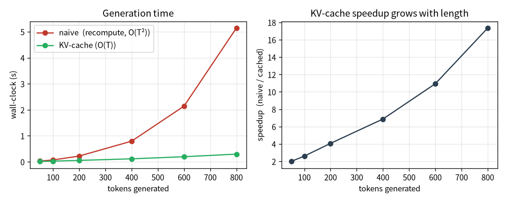

# 跑多快：FlashAttention、KV-cache、取樣 {#sec-efficiency}

> **一句話**：效率技巧能省記憶體、加速生成——但「省」不等於「一定更快」。這一章有一個我親手量到、
> 跟直覺相反的反例。

第 2 章的零件多半在改「準」或改架構。這一章我們看純粹的「跑得快、佔得少」——以及一個重要的教訓：
效率技巧的好處**跟你的 regime 強相關**，不能照搬論文結論。

```{mermaid}
%%| fig-cap: "你在這裡：讓模型跑得快、佔得少（FlashAttention、KV-cache、取樣）。"
flowchart LR
  A["01 GPT"]-->B["02 零件"]-->C["03 效率"]-->D["04 資料"]-->E["05 評估"]-->F["06 服務"]-->G["07 治理"]-->H["08 漂移"]
  E -.後訓練.-> I["09 對齊"]
  classDef here fill:#c0392b,color:#fff,stroke:#7b241c,stroke-width:2px;
  class C here
```

::: {.callout-note collapse="true"}
## 這章的定位（讀之前先對齊期待）
**假設你已經會**：第 1 章的 attention（$O(T^2)$ 的分數矩陣）與自回歸生成。不需要任何
CUDA / 系統優化背景。

**學完你會**：(1) 講清楚 FlashAttention（省記憶體）與 KV-cache（省重算）各自省的是什麼、為什麼；
(2) **逐行**把 KV-cache 的生成迴圈建起來；(3) 在**你自己的 CPU 上**親手量到 KV-cache 的加速、
並**先證明它沒算錯**（逐 token 對拍）。最重要的是學到一個習慣：**別信「一定更快」，去量你自己的
workload。** 本章 💻 配套程式 `tiny_kvcache.py` 純 CPU、十幾秒、不需語料。
:::

::: {.callout-tip collapse="true"}
## 🎯 給技術主管：本章關鍵術語速查（懂的人可跳過）
不必親手實作也能跟上——每個術語一句白話 + 為什麼你該在意（成本 / 延遲 / 風險）。

- **context 長度（T）**：模型一次能看多少 token。*在意它*：決定能塞多長的輸入，也是算力與記憶體成本的主因（隨 $T$ **平方**成長）。
- **$O(T^2)$**：成本隨長度平方膨脹的記號。*在意它*：這就是長文場景延遲與帳單暴衝的來源。
- **FlashAttention**：數學等價、但更省記憶體的 attention 算法。*在意它*：同一張 GPU 能吃更長 context＝直接省成本 / 擴容，零品質代價。
- **KV-cache**：生成時快取算過的中間值、每步只算新 token。*在意它*：長生成的速度關鍵——但**「省」不等於「快」**，划不划算要看場景。
- **取樣（top-k / top-p / min-p）**：從模型輸出挑下一個字的策略。*在意它*：決定輸出是保守還是有創意；品質要用「人讀」評，不是看 loss。
- **regime（場景）**：硬體 × 模型大小 × 序列長度的組合。*在意它*：同一個優化在不同 regime 結論可能相反——別照搬論文，要量自己的 workload。
:::

## FlashAttention：同樣的數學，更省的算法

回想第 1 章的 attention：它會把整個 $T\times T$ 的分數矩陣 $\frac{QK^\top}{\sqrt d}$ 攤出來、做 softmax、
再乘 $V$。問題是那個矩陣是 $O(T^2)$ 的記憶體——序列一長就爆。

FlashAttention 的洞見是：**最終結果不需要把整個矩陣存下來**。它把計算分塊（tiling），邊算邊累加，
用一個數值穩定的線上 softmax，讓記憶體從 $O(T^2)$ 降到 $O(T)$。關鍵是——**數學上完全一樣**，不是近似。

在程式碼裡，這甚至只是換一個呼叫：

```python
y = F.scaled_dot_product_attention(q, k, v, is_causal=True)  # <1>
```
1. PyTorch 內建的 FlashAttention。`is_causal=True` 幫忙做因果遮罩。結果跟第 1 章那個樸素版「逐位相等」，
   我寫了測試驗證兩者 logits 差只有 $6\times10^{-7}$。

**實測**：同一台機器（RTX 5070、8 GB），樸素 attention 的 context 上限約 1024，換 FlashAttention 後
約 4096——**同樣的卡，4 倍**。這是純粹的「省」（記憶體），讓你能訓更長的 context。

## KV-cache：一個「不一定更快」的反例 {#sec-kvcache}

生成是自回歸的：吐一個 token、接回去、再吐下一個。問題是每多一個 token，attention 就要重算前面**所有**
token 的 key 和 value——這是 $O(T^2)$ 的重複勞動。KV-cache 的點子很直觀：把算過的 key/value 快取起來，
每步只算「新 token」那一個，理論上 $O(T^2)\to O(T)$。

聽起來一定更快，對吧？我也這麼以為。然後我去量了。

::: {.callout-warning}
## 「省」不等於「快」——要看 regime
我實測 KV-cache 在 **CPU 長生成**快 2.2×（符合預期）。但在我的 **GPU + 小模型（8M）+ 短生成**，
反而**慢約 18%**。為什麼？

KV-cache 讓你「一次只算一個 token」。在 GPU 上，一次算一個 token **浪費了 GPU 的平行度**——GPU 喜歡
一次算一大批。再加上每步都有固定的啟動開銷（kernel launch、Python 迴圈）。當模型小、序列短時，這些
per-step 開銷**超過**了省下來的 $O(T^2)$ 重算。

**結論：一個技巧是否真的省/快，取決於你的 regime（硬體 × 模型大小 × 序列長度），別照搬論文結論——
量你自己的 workload。**
:::

這個反例是整本書方法論的縮影，值得停下來體會一下這個形狀：

1. **先預測**：KV-cache 一定更快（理論上 $O(T^2)\to O(T)$）。
2. **親手量**：在我的 GPU 上反而慢 18%。
3. **想懂為什麼**：平行度浪費 + per-step 開銷 > 省下的重算，在小模型短生成的 regime 裡。

如果只信直覺、不去量，你會在錯的地方優化。

### 逐行把 KV-cache 建起來 {#sec-build-kvcache}

樸素生成每一步都把「越來越長的整段」重餵一次（第 1 章那個 `generate`）。KV-cache 的差別只有一句話：
**把算過的 key/value 留著，每步只算新 token 那一個**。我們把它逐行建出來。

**第 0 步——樸素版在浪費什麼。** 生第 $t$ 個字時，樸素版重算位置 $0..t$ 全部的 q/k/v，但其中
$0..t{-}1$ 的 k/v 跟上一步**一模一樣**。這就是 $O(T^2)$ 的重複勞動：

```python
def generate_naive(self, idx, n):
    for _ in range(n):
        logits = self(idx[:, -block_size:])      # 整段重跑一次（含已算過的 k/v）
        nxt = logits[:, -1, :].argmax(-1, keepdim=True)
        idx = torch.cat([idx, nxt], dim=1)
    return idx
```

**第 1 步——一個能吃 cache 的 attention step。** 改寫 attention：只收「新 token」一個 `(B,1,C)`，
把它的 k/v **接到歷史 cache 後面**，再讓新 query 對「整段歷史 + 自己」算 attention。注意
**不需要因果遮罩**了——cache 裡全是過去，本來就看得到：

```python
def step(self, x_t, cache):                       # x_t 只有新 token：(B,1,C)
    q, k, v = self.qkv(x_t).split(n_embd, dim=2)
    # ...reshape 成多頭...
    if cache is None:
        k_all, v_all = k, v
    else:
        k_all = torch.cat([cache[0], k], dim=2)   # 接上歷史 key
        v_all = torch.cat([cache[1], v], dim=2)   # 接上歷史 value
    att = q @ k_all.transpose(-2, -1) / math.sqrt(head_dim)  # 不必遮罩：cache 全是過去
    y = F.softmax(att, dim=-1) @ v_all
    return self.proj(...), (k_all, v_all)         # 回傳輸出 + 更新後的 cache
```

**第 2 步——生成迴圈：先灌 prompt、之後每步一個 token。** 把每層的 cache 串起來，每步只前傳
一個新 token，$O(T^2)\to O(T)$：

```python
def generate_cached(self, idx, n):
    caches = [None] * n_layer
    # 先把 prompt 逐 token 灌進 cache（略）...
    for _ in range(n):
        nxt = logits[:, -1, :].argmax(-1, keepdim=True)
        x = self.tok(nxt) + self.pos(...)
        for i, b in enumerate(self.blocks):
            x, caches[i] = b.step(x, caches[i])   # 每步只算新 token 那一個
        logits = self.head(self.lnf(x))
    return out
```

## 💻 在你的機器上：先證它沒算錯，再看它快多少 {#sec-tiny-kvcache}

效率優化最容易犯的錯，是「優化完忘了驗證結果還對不對」。配套程式 `tiny_kvcache.py`（純 CPU、
十幾秒、不需語料）刻意把順序倒過來：**先證對、再看快**。

模型用隨機初始化即可——**計時跟模型好不好無關，只跟「算多少」有關**。用 greedy 解碼讓兩條路徑
可以逐 token 對拍：

```bash
python tiny_kvcache.py
```

在我的 Framework 16（純 CPU）上：

```
參數 0.95M，context 上限 1024，生成 500 token，device=cpu

逐 token 完全相同？ True（KV-cache 是省、不是近似）
naive  （每步重算全序列）：  1.48 s
cached （每步只算新 token）：  0.15 s
加速：10.13×
```

**怎麼讀**：第一行最重要——cached 與 naive 的輸出**逐 token 完全相同**，證明 KV-cache 是
數學等價的「省」，不是會改變結果的近似。確認對了，才看第二件事：CPU 上長生成快了約 10 倍。
這正好對上前面那個 regime 故事的另一面——**KV-cache 在「CPU 長生成」這個 regime 是大勝**，
在「GPU 小模型短生成」反而會輸。同一個技巧，兩個相反結論，全看 regime。

把不同生成長度跑一輪、畫出來，就看到那條 $O(T^2)$ vs $O(T)$ 的差距隨長度張開（@fig-kvcache）：

{#fig-kvcache width=92%}

::: {.callout-tip}
## 加速倍率會隨設定變——這正是重點
你跑出來的倍率不會剛好是 10×：它隨**生成長度**（越長，naive 的 $O(T^2)$ 浪費越多、cached 贏越多）、
層數、執行緒數而變。把 `n_new` 從 500 改成 100 再改成 1000，看倍率怎麼動——你會親手畫出
「$O(T^2)$ vs $O(T)$」這條差距隨長度張開的曲線。
:::

## 取樣：從機率分布裡怎麼抽下一個字

模型每一步輸出的是「下一個字的機率分布」。怎麼從這個分布抽一個字出來，決定了輸出的風格——
保守正確 vs 大膽創意。常見三招：

- **top-k**：只留機率最高的 $k$ 個候選，固定數量。
- **top-p（nucleus）**：從高到低累積機率到 $p$ 為止——候選**數量會自適應**（分布尖時少、平時多）。
- **min-p**：相對於峰值的門檻（低於「最高機率 × min_p」的都砍掉），2024 年提出，高溫下比 top-p 更穩。

```python
if top_p is not None:                                  # <1>
    s_logits, s_idx = torch.sort(logits, descending=True, dim=-1)
    cum = torch.cumsum(F.softmax(s_logits, dim=-1), dim=-1)
    remove = cum > top_p                               # <2>
    ...
```
1. top-k 是「固定數量」、top-p 和 min-p 是「自適應截斷」——同一類、差在累積 vs 相對峰值。
2. 累積機率超過 $p$ 的尾巴砍掉，只在「核心 (nucleus)」裡抽。

::: {.callout-tip}
## 取樣方法用「人讀」選，不是用 loss
選哪個由**任務**決定：要正確的答案就用冷一點、低溫；要創意就用暖一點、min-p。而且評估取樣品質要
用「人讀起來如何」，不是用 loss——loss 量的是「對不對」，不是「好不好讀」。這呼應第 5 章「選對指標」。
:::

## 帶走什麼

- FlashAttention：數學等價、記憶體 $O(T^2)\to O(T)$，同卡 context ×4——純粹的省。
- KV-cache **不一定更快**：小模型短生成的 GPU 上反而慢 18%。省的技巧是否真省，看你的 regime、量你的 workload。
- 取樣方法（top-k/top-p/min-p）的選擇由任務決定，用人讀來判斷，不是 loss。
- 這一章的核心不是某個技巧，是一個習慣：**別信「一定更快」，去量。**

## 練習 {#sec-ch3-exercises}

::: {.callout-note}
## 1（先預測）：加速倍率隨生成長度怎麼變？
在 `tiny_kvcache.py` 把 `n_new` 依序設成 100、500、1000。**先寫下你的預測**：加速倍率會往哪個方向走？
為什麼？

::: {.callout-tip collapse="true"}
## 參考答案
倍率隨生成長度**變大**。naive 的總成本是 $O(T^2)$（每步重算越來越長的序列），cached 是 $O(T)$；
序列越長，naive 浪費的重算越多、差距張得越開。短生成時 cached 的好處還不明顯，這也呼應「GPU 小模型
短生成反而慢」——在那個 regime，per-step 開銷大過省下的重算。
:::
:::

::: {.callout-note}
## 2（動手）：算一次記憶體帳
FlashAttention 把 attention 的記憶體從 $O(T^2)$ 降到 $O(T)$。假設 context 從 1024 變 4096（×4），
樸素 attention 的分數矩陣記憶體變幾倍？這跟本章「同卡 context ×4」的實測怎麼對上？

::: {.callout-tip collapse="true"}
## 參考答案
分數矩陣是 $T\times T$，$T$ ×4 → 記憶體 ×16。所以在固定顯存下，省掉這塊 $O(T^2)$ 正是讓你能把
context 拉長好幾倍的原因；本章「同卡 1024→4096」的實測就是這個帳的具體結果。FlashAttention 是
數學等價的「省」——記憶體省下來，數字不變。
:::
:::

::: {.callout-warning}
## 3（弄壞）：拔掉 KV-cache 的「接歷史」
把 `Attn.step` 裡 `torch.cat([cache[0], k], ...)` 改成只用當前的 `k`（不接歷史），重跑對拍。

::: {.callout-tip collapse="true"}
## 參考答案
「逐 token 完全相同？」會變成 `False`——少了歷史 key/value，每個新 token 只能注意到自己，等於
把因果上下文整個丟掉，生成立刻走樣。這證明 cache 不是「順便快取」，它**承載了全部歷史脈絡**；
也是為什麼第 0 步要先確認「對不對」再談「快不快」。
:::
:::
