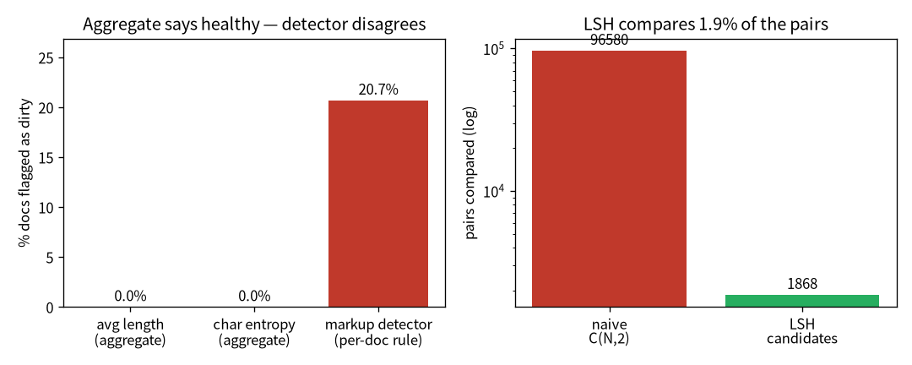

# 真實資料的坑：從 1 MB 英文到 105 MB 中文 {#sec-data}

> **一句話**：把玩具語料換成真實規模的中文維基後，原本 pipeline 的假設一個個破——而最危險的問題，
> 是聚合指標看不到、只有「真的去看資料」才現形的那種。

模型架構是一回事，**餵它什麼**是另一回事——而且後者往往更決定成敗。前面幾章我用的是 1 MB 的英文
莎士比亞，乾淨、小、好懂。這一章我換成 **105 MB、11,000 多篇中文維基**，看看真實規模的資料會怎麼
把我原本「想當然耳」的假設一個個打破。

::: {.callout-note}
## 這章的定位（讀之前先對齊期待）
**假設你已經會**：基本集合運算與機率直覺。不需要任何 NLP 資料工程背景。

**學完你會**：(1) 說出跨語言（英→中）會打破哪些「想當然耳」的假設；(2) **逐行**理解 MinHash + LSH
怎麼把去重從 $O(n^2)$ 降到接近 $O(n)$；(3) 在**你自己的 CPU 上**親手重現本章兩個最重要的瞬間——
**聚合指標說「健康」但一條偵測器抓出 20% 髒資料**，以及 **LSH 只細比 ~2% 的對就找到重複**。
本章 💻 配套程式 `tiny_dedup.py` 純標準庫、不需 torch、幾秒跑完。
:::

## 英文假設一個個破

我的 pipeline 是照英文資料寫的。換成中文後，第一批壞掉的是這些：

| 原本（英文玩具）| 換成中文後壞在哪 | 修法 |
|---|---|---|
| 用空白切詞做 shingle 去重 | 中文沒空白 → 整篇變成「一個詞」→ 去重失效 | 改用**字元 n-gram** |
| 兩兩比對 $O(n^2)$ | 11k 篇純 Python 跑「幾小時/卡死」 | 加 **MinHash + LSH**（見 @sec-minhash-math）|
| 熵門檻是英文校準的（3.5–6）| 中文字元熵 9.70，被誤判成「不健康」| 改用**熵效率**（熵 / $\log_2$ vocab，跨語言通用）|

每一條都是同一個教訓：**跨語言別照搬假設**。英文用空白分詞、熵的尺度、甚至「一個 token 多大」，
換到中文全都要重想。

## MinHash + LSH：把去重從 $O(n^2)$ 降到接近 $O(n)$

近似去重的天真做法是「每兩篇算一次相似度」——$O(n^2)$，11k 篇就是上億次比較，純 Python 跑不動。
MinHash + LSH 是經典的解法，背後有漂亮的機率論（完整推導見 @sec-minhash-math），直覺是：

1. **MinHash**：把每篇文件壓成一個短「簽章」，性質是——兩篇的簽章相等的機率，**恰好等於**它們的
   Jaccard 相似度。於是「比簽章」就近似「比相似度」，但便宜得多。
2. **LSH banding**：把簽章切成幾個 band，只有「至少共用一個 band」的文件對才拿出來細比。這讓你
   **跳過絕大多數不可能相似的對**，候選對數量大降。

### 逐行把去重管線建起來 {#sec-build-dedup}

我們用 `tiny_dedup.py` 把這條管線一步步建出來——字元 n-gram → MinHash 簽章 → LSH 找候選 →
再算真實 Jaccard 確認。

**第 0 步——shingle（字元 n-gram）。** 中文沒空白，所以不切詞、改切**字元 5-gram**：把每篇變成
一個「片段集合」。兩篇的相似度就用集合的 Jaccard 來定義：

```python
def shingles(s, k=5):
    s = re.sub(r"\s+", " ", s)
    return {s[i:i+k] for i in range(max(1, len(s) - k + 1))}

def jaccard(a, b):
    return len(a & b) / len(a | b)        # 交集 / 聯集
```

**第 1 步——MinHash 簽章。** 對每個 shingle 算一組雜湊，取**最小值**當一個簽章分量；換 64 組
雜湊就得到 64 維簽章。神奇性質：兩篇簽章某一維相等的機率，**恰好等於**它們的 Jaccard。
（雜湊用 `crc32` 而非 Python 內建 `hash()`——後者對字串會加鹽、跨 process 不可重現。）

```python
def minhash(shingle_set):
    base = [zlib.crc32(x.encode()) for x in shingle_set]
    return [min((a*h + b) % PRIME for h in base) for a, b in coeffs]  # 64 維簽章
```

**第 2 步——LSH banding 找候選。** 把 64 維簽章切成 16 個 band（每 band 4 維），同一 band 完全
相同的文件丟進同一個桶。**只有同桶的文件對**才是候選——這一步把 $O(n^2)$ 砍成「只比可能相似的」：

```python
for i, sig in enumerate(sigs):
    for band in range(BANDS):
        key = (band, tuple(sig[band*ROWS:(band+1)*ROWS]))
        buckets[key].append(i)            # 同一 band 相同 → 同桶 → 候選
```

**第 3 步——對候選算真實 Jaccard 確認。** 只對候選對算一次精確 Jaccard，超過門檻才判為重複。
LSH 負責「便宜地縮小範圍」，精確比對負責「最後確認」：

```python
dupes = {(i, j) for (i, j) in candidates if jaccard(sh[i], sh[j]) > 0.5}
```

**實測**：改造後，11,126 篇中文維基 **21.6 秒**去完、抓出 161 篇近似重複。舊版（空白切詞 + 兩兩比）
會跑幾小時或直接卡死。這是個純粹的「省」——演算法複雜度的勝利。

## 聚合指標的盲點（本章的核心教訓）

去重做完、清洗做完，我算了一輪資料品質指標：字元熵、壓縮比、重複率——**全部顯示「資料健康 ✅」**。
照理說可以開始訓練了。但我有個從稽核帶來的本能：**不信任「總分漂亮」**。總分漂亮，常常只是因為
問題被平均掉了。

所以我做了一件事：把「看資料」這個動作**工業化**。

::: {.callout-important}
## 一定要「看資料」，並把眼睛固化成程式
我寫了一套**資料品質偵測器**：7 條規則（wiki 標記、HTML、控制字元、URL、符號洗版、重複、過短）
掃過全語料，量化每條的命中率、設門檻當資料 gate、並抽出問題片段樣本。

結果抓到 **21.6%（2,407 篇）** 文件殘留維基的繁簡轉換語法 `-{zh-tw:..;zh-cn:..}-`——這是**任何聚合
指標都看不到**的。熵、壓縮、重複率全說健康，因為這些髒東西只佔每篇的一小部分、被平均稀釋掉了。
只有「真的去看樣本 + 把問題寫成偵測器」才讓它現形。

修一條清洗規則（解析並抽取繁簡語法），21.6% → **0.05%**，整批 gate 從 ❌ 變 ✅。我用監控面板的
before/after 對照圖留下視覺證據。
:::

這套偵測器系統的心法，跟我疊稽核控制項是同一個思路：

> **看樣本發現問題 → 寫成一條偵測器 → 累積成資料的測試套件。**

每抓到一種新的髒資料，就多一條偵測器；久了，這套偵測器就成了「資料的回歸測試」——下次語料更新，
跑一遍就知道有沒有舊問題復發、有沒有新問題冒出來。一條來源動到 5–15 條偵測器是常態。

## 💻 在你的機器上：聚合指標的盲點 + LSH 的速度 {#sec-tiny-dedup}

這兩課不必有 105 MB 中文維基也能親手摸到。配套程式 `tiny_dedup.py`（純標準庫、不需 torch、
幾秒跑完）拿莎士比亞切成「文件」，**動手注入**近似重複與一種藏起來的髒語法，再把兩課跑一遍：

```bash
python tiny_dedup.py
```

在我的 Framework 16 上跑出來（節錄）：

```
語料：440 篇文件（含注入的 40 組近似重複、85 篇含髒語法）
=== 聚合指標（總分）===
  平均文件長度：   238 字元
  全語料字元熵：  4.72 bits/char
  → 看起來資料健康 ✅（長度正常、熵正常）
=== 一條偵測器（看樣本後寫成規則）===
  命中 markup 髒語法：91/440 = 20.7% 文件     ← 聚合指標完全看不到
=== 去重：naive vs MinHash+LSH ===
  naive：比較  96580 對（C(N,2)，O(n²)），抓到 41 組，3446 ms
  LSH  ：只細比    1868 個候選對，抓到 38 組，1135 ms
  LSH 候選只佔 naive 的 1.9%
```

**怎麼讀——兩課各一個數字**：

1. **聚合指標的盲點**：平均長度、字元熵都說「健康 ✅」，但一條 regex 偵測器抓出 **20.7%** 的文件
   殘留 markup 髒語法。為什麼總分看不到？因為髒東西只佔每篇一小段、被平均稀釋掉了——這正是真實
   專案裡 **21.6% 繁簡語法**那一課的最小可重現版。**總分漂亮，常常只是問題被平均掉了。**
2. **LSH 的速度**：naive 要比 96,580 對（$O(n^2)$），LSH 只細比 **1.9%** 的候選對就找到幾乎同一批
   重複。$N$ 越大這個比例越懸殊——這就是 $O(n^2)\to$ 接近 $O(n)$ 的來源。（LSH 是**近似**法，會
   漏掉幾組卡在門檻邊界的對，是用一點 recall 換速度；要更高 recall 就加 band。）

@fig-dedup 把這兩課畫在一起：

{#fig-dedup width=92%}

## 收成：真實中文 GPT

清洗修好後重新跑完整 pipeline：collect 11,126 篇 → 清洗 → 去重 161 篇 → tokenize（字元級、vocab
14,210，全是中文字）→ pack 成 train 31.4M token。訓一個 6 層 / 256 維的現代架構模型（RoPE + GQA +
SwiGLU + RMSNorm + Flash），四個成功判準全達標（細節見 @sec-eval），生成出可讀的中文片段——
真詞、語法、標點都對，整體不連貫是 8M 小模型的預期水準。

## 帶走什麼

- 跨語言別照搬假設：切詞、熵門檻、token 大小在中文都要重想。
- 近似去重靠 MinHash + LSH 從 $O(n^2)$ 降到接近 $O(n)$——一個有漂亮機率論證的工程勝利。
- **聚合指標必要但不夠。** 一定要看樣本，並把「看資料的眼睛」寫成偵測器、累積成資料的測試套件。
  21.6% 的髒資料，聚合指標全說健康——這是整本書最重要的「相信資料、不相信總分」的一課。

## 練習 {#sec-ch4-exercises}

::: {.callout-note}
## 1（先預測）：把 LSH 的 band 數調多會怎樣？
`tiny_dedup.py` 用 16 個 band（每 band 4 維）。**先寫下你的預測**：把 `BANDS` 調大（每 band 更少維），
recall（抓到的真重複比例）和候選對數量會往哪個方向走？

::: {.callout-tip collapse="true"}
## 參考答案
band 越多、每 band 維度越少 → 兩篇「至少共用一個 band」越容易 → **recall 升高，但候選對也變多**
（更多誤報要細比，變慢）。這是 LSH 的核心取捨：band 配置在「漏掉真重複」與「比太多假候選」之間調。
動手把 `BANDS` 改成 32 看 recall 和候選數一起怎麼動。
:::
:::

::: {.callout-note}
## 2（動手）：新增一條偵測器
照 `tiny_dedup.py` 裡那條 regex 的樣子，加一條偵測「殘留 HTML 標籤」或「URL 洗版」的規則，
注入對應的髒資料、量它的命中率。

::: {.callout-tip collapse="true"}
## 參考答案
重點不在 regex 本身，而在養成那個循環：**看樣本發現問題 → 寫成一條偵測器 → 累積成資料的回歸測試**。
每多一條，下次語料更新就多一道自動關卡。這就是把「看資料的眼睛」工業化——一條來源動到 5–15 條
偵測器是常態。
:::
:::

::: {.callout-warning}
## 3（弄壞）：用英文校準的熵門檻去判中文
本章提到中文字元熵約 9.70，被英文校準的門檻（3.5–6）誤判成「不健康」。在 `tiny_dedup.py` 裡把
`char_entropy` 換算成不同單位、或想像套用英文門檻，會發生什麼？

::: {.callout-tip collapse="true"}
## 參考答案
直接套英文的絕對熵門檻，會把完全正常的中文語料判成異常——因為中文 vocab 大得多、單字元熵天生
就高。修法是改用**熵效率**（熵 / $\log_2$ vocab），把尺度正規化成跨語言通用。這呼應本章主線：
**跨語言別照搬假設**——切詞、熵門檻、token 大小換到中文全要重想。
:::
:::
