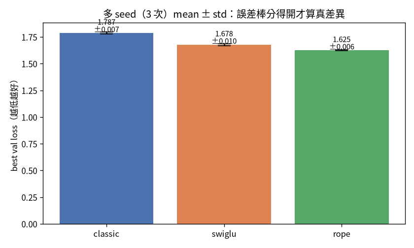

# 不騙自己的評估 {#sec-eval}

> **一句話**：評估難的不是算數字，是**選對該量的東西、並質疑它有沒有被汙染**。這是整本書的主線，
> 這一章把它講透。

訓練一個模型不難，難的是「誠實地知道它到底好不好」。這一章講四件事：先講判準、用對的尺、知道什麼
時候該重複跑、以及——最重要的——**質疑你的尺有沒有被汙染**。

## 先講判準，再驗證

最容易自欺的方式，是訓完之後才去找「它哪裡好」。所以我的紀律是**訓練前先寫死「什麼叫成功」**，
訓完逐項對，不事後移動球門：

| 判準 | 怎麼量 | 結果 |
|---|---|---|
| 有沒有在學？ | val loss vs 亂猜基準 $\ln 14210 = 9.56$ | 9.59 → 3.67 ✅ |
| 會不會類推？ | test loss ≈ val loss？ | test 3.695 ≈ val 3.677（gap 0.018）✅ |
| 學了多少？ | BPC vs 無條件熵 9.70 | 5.33 bits/char（靠上下文砍 45%）✅ |
| 像不像中文？ | 質性讀生成樣本 | 真詞/語法/標點對，整體不連貫＝小模型水準 ✅ |

注意「亂猜基準」那一格：一個 vocab 14,210 的模型，如果完全亂猜，loss 就是 $\ln 14210 \approx 9.56$。
所以 val loss 從 9.59 掉到 3.67，第一件事就證明了「它真的在學」，而不是我在自我感覺良好。**先有基準，
數字才有意義。**

## 用對的尺：BPC 而不是 raw loss

我做了 char-level 和 BPE 兩種 tokenizer 的對比，結果踩到一個陷阱：

::: {.callout-warning}
## 跨 tokenizer 的 raw loss 不能比
char（vocab 65）的 cross-entropy 是 1.77，BPE（vocab 365）是 3.34——看起來 char 大勝？**錯。**
兩者的「類別數」不同（65 類 vs 365 類），cross-entropy 的尺度本來就不一樣，不能直接比。

公平的指標是 **BPC（bits per character）**：

$$\text{BPC}=\frac{\text{loss}}{\ln 2}\Big/\frac{\text{字元數}}{\text{token 數}}$$

把它換算到「每個字元幾 bit」這個跨 tokenizer 通用的尺度上。換完：char 2.56 vs BPE **2.37**——其實是
BPE 更好、而且序列只有一半長。**換對尺，結論整個翻過來。**
:::

## 重大性原則：什麼時候該跑多 seed

單次訓練跑出來的數字，帶著抽樣的運氣。我用多 seed（跑 N 個不同隨機種子，報 mean ± std + 誤差線）
確認了第 2 章 SwiGLU/RoPE 的改善是真的：

{#fig-multiseed width=72%}

實測 3 seed：classic 1.787±.007、SwiGLU 1.678±.010、RoPE 1.625±.006。SwiGLU 比 classic 差 0.109，是雜訊
（≈0.01）的 11 倍；RoPE 差 0.162，是 22 倍——**確認是真差異，不是運氣**。我還抓到一件事：之前單次跑的
classic baseline 1.7712 其實是運氣偏低，真實 mean 是 1.787——**單一裸數字會騙人。**

但多 seed 不必每次做。它的價值**非均勻**：

::: {.callout-tip}
## 重大性原則（借自稽核）
大差距（如 SwiGLU/RoPE）單次跑就看得出來，多 seed 是冗餘的。多 seed 真正有用的場合，是「差距小到
跟雜訊同級」的決策——那時單次會誤導你。

所以原則是：**只在「差距小、決策貴、或要對外宣稱」時才加做多 seed。** 這跟稽核的重大性原則一模一樣：
不是每個科目都查到底，是把查核力氣放在「錯了會出大事」的地方。
:::

## 選對指標：一把被汙染的尺如何給出相反的結論

這是整本書最重要的一課，我用後訓練的一個真實例子來講（完整脈絡在第 7 章）。

做完 SFT（指令微調）後，我要評估它有沒有變好。直覺是用「維基 perplexity」——結果顯示 SFT **變爛**了
（perplexity 升高）。如果我就此下結論，我會說「SFT 沒用」。但那把尺**被汙染**了：

- 維基 perplexity 是**預訓練**的尺。SFT 為了學會「應答格式」付出了 alignment tax，在「續寫維基」這件
  它不再專注的事上自然變差——但這不代表它變笨。
- 我退一步，改量「回答段對 gold 答案的 loss」，以為這樣公平。結果**還是被汙染**：gold 答案是維基定義句，
  base 模型預訓練時看過，所以 base 的 loss 反而低。尺又一次騙了我。

最後我換成量「**行為**」而不是「背特定答案」：生成式應答行為率——給一個問題，模型是否以定義句回應
（不需要 gold）。結果 base 29% → SFT **72%**，才終於看出 SFT 的真價值。

> **同一顆模型、不同的尺、相反的結論。** 用維基 perplexity 它「變爛」、用行為率它「大幅變好」。差別
> 不在模型，在**我選的尺有沒有被汙染**。

## 帶走什麼

- **先講判準、再驗證**，並且永遠先有「亂猜基準」，數字才有意義。
- 跨 tokenizer 用 BPC 比，不用 raw loss——換對尺，結論可能整個翻。
- 多 seed 看**重大性原則**：只在差距小、決策貴、要對外宣稱時做，不必每次。
- **評估的真正難點，是選對指標、並質疑它有沒有被汙染。** 這個形狀會在第 7 章的對齊一再出現——
  SFT 的尺被汙染、DPO 的 train-acc 騙人、RLHF 的 reward model 被鑽。學會質疑你的尺，比學會任何單一
  技巧都重要。
