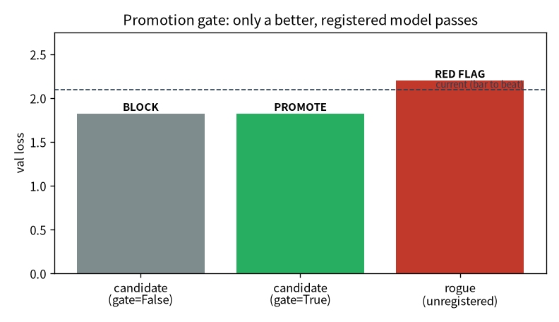

# 上線與治理：把稽核接到 ML {#sec-governance}

> **一句話**：訓練是「離線、一次性、看 loss」；服務是「線上、持續、面對真實流量」。這一章把企業 IT
> 的治理視角接到模型上——這是我從本行帶來、跟一般 ML 工程師最不一樣的地方。

前面五章我們把一個模型訓出來、評估好了。但「訓出一個好模型」和「有一個能上線、能被呼叫、能被稽核
的系統」是兩回事。這一章把模型一路推到「能上線、能治理」——用我熟悉的企業 IT 視角。

::: {.callout-note}
## 這章的定位（讀之前先對齊期待）
**假設你已經會**：第 5 章的評估判準。不需要 MLOps / k8s 背景（會用到的概念都會在這裡建立類比）。

**學完你會**：(1) 說出服務化跟訓練要的東西差在哪（快/可觀測/可重現/可治理）；(2) **逐行**把模型
治理的核心建起來——**用 sha256 digest 當身份、用 promotion gate 程式擋上線**；(3) 在**你自己的
CPU 上**親手證明「digest 認內容不認檔名」、並看 gate 把不合格的候選 BLOCK 掉。這是治理/稽核背景
轉進 ML 最差異化的一段。本章 💻 配套程式 `tiny_serve.py` 純 CPU、約一分鐘。
:::

## 從訓練到服務

服務跟訓練要的東西完全不同：要快、要能被呼叫、要看得到、要可重現、要可治理。我把它一層層接起來：

- **推論 API**：用 FastAPI 把模型包成服務，常駐載入 checkpoint 和 tokenizer。端點有 `/health`
  （就緒探針，回模型載好沒、device、參數量）、`/generate`（主端點，回生成文字 + 延遲 + 吞吐）、
  `/metrics`（給 Prometheus 抓）、`/model`（治理，回報自己是哪顆模型）。
- **可觀測性**：Prometheus metrics（請求數、延遲 histogram、生成 token 數）加結構化 JSON 日誌，
  每個請求自動計數、計時、記狀態。一裝上就抓到一個現象：

::: {.callout-note}
## 可觀測性立刻抓到「冷啟動」
我沒特別找，metrics 一上線就顯示：**第一個 `/generate` 請求約 354 ms，暖機後降到約 50 ms**。
原因是首次呼叫時 CUDA kernel 要即時編譯。這種「你不量就不知道、量了立刻看到」的東西，正是可觀測性
的價值——它把模糊的「好像第一次比較慢」變成「354 vs 50 ms」的事實。
:::

- **容器化**：用 Podman + GPU（透過 CDI passthrough）把服務打包。模型權重用 runtime mount 掛進去、
  跟映像解耦——換模型不用重 build 映像。
- **監控儀表板**：Prometheus + Grafana，用一個 podman pod 把 API、Prometheus、Grafana 三個容器放在
  一起、共享 localhost。

::: {.callout-tip}
## podman pod 就是 k8s「Pod」的微縮版
把多個容器放進一個 pod、共享網路命名空間、互相用 localhost 找得到——這正是 Kubernetes「Pod」概念的
微縮版。單機這樣剛好夠；要多副本、跨機、自動擴縮，才需要真的 k8s。從這裡到 k8s 是一條平滑的路。
:::

## 模型治理＝對「線上的模型」答得出四個稽核問題

這是我最想經營的一段。在銀行，任何上線的東西都要能回答稽核：這是誰改的、改了什麼、測過沒、誰批准。
我把同一套骨架搬到模型上——只是對象從應用程式換成 model checkpoint：

::: {.callout-important}
## 治理的四問
1. **哪一個？** 模型身份用 ckpt 的 **sha256 digest**——像 container image digest 或 cosign 簽章，**不靠
   檔名**。檔名會騙人、會被覆寫；digest 是內容的指紋。
2. **吃什麼訓的？** **lineage（血緣）**：每筆註冊綁上資料 digest + 資料品質 gate 結果 + config + git commit。
   問「這顆模型是用哪批資料、哪份設定、哪個 commit 訓的」要答得出來。
3. **表現如何？** **model card**：一份人讀的單據（`registry/cards/<digest>.md`），記錄這顆模型的評估數字、
   用途、限制。而且它**進 git**——成為審計軌跡的一部分。
4. **憑什麼上線？** **promotion gate**：沒過資料品質 gate、沒過評估，就**擋下**——上線不是「誰想推就推」，
   是被程式 enforce 的。服務端 `/model` 會回報自己跑的 digest + registry 狀態，確認線上那顆是不是被批准
   的那顆（回報 `UNREGISTERED` 就是稽核紅旗）。
:::

這四問為什麼重要？因為**模型治理的本質，跟 IT 變更管理是同一件事**——只是多了「資料」這個變數。
而「要可審計軌跡、要 gate、要能回答稽核」正是我的本能。這是治理/稽核背景轉進 ML 的最大優勢，
不是包袱。

### 逐行把治理建起來 {#sec-build-governance}

四問裡最該親手寫一次的是第 1 問（身份）和第 4 問（gate）。我們用 `tiny_serve.py` 逐行建出來。

**第 0 步——身份 = 權重 bytes 的 sha256。** 不用檔名當身份——檔名會被改、被覆寫。把 checkpoint 的
權重序列化後算 sha256，內容的指紋就是身份（概念上等同 container image digest / cosign 簽章）：

```python
def digest(model):
    buf = io.BytesIO()
    torch.save(model.state_dict(), buf)
    return hashlib.sha256(buf.getvalue()).hexdigest()
```

**第 1 步——台帳（registry）綁住 lineage。** 每顆模型的 digest 對應一筆紀錄：評估數字 + 資料品質
gate 結果 + git commit。這就是「吃什麼訓的、表現如何」答得出來的來源：

```python
def register(model, *, val_loss, data_gate, git_commit):
    REGISTRY[digest(model)] = dict(val_loss=val_loss, data_gate=data_gate,
                                   git_commit=git_commit)
```

**第 2 步——promotion gate 用程式 enforce「憑什麼上線」。** 查不到台帳 → 紅旗；沒過資料 gate → 擋；
沒比現行更好 → 擋。上線不是「誰想推就推」，是被這幾行擋住：

```python
def promote(model, current_loss):
    rec = REGISTRY.get(digest(model))
    if rec is None:           return False, "UNREGISTERED（台帳查無，稽核紅旗）"
    if not rec["data_gate"]:  return False, "BLOCK：資料品質 gate 未過"
    if rec["val_loss"] >= current_loss:
        return False, "BLOCK：未比現行更好"
    return True, "PROMOTE：通過"
```

## 💻 在你的機器上：digest 身份 + promotion gate {#sec-tiny-serve}

治理聽起來抽象，但它的核心是可執行、可親手驗證的。配套程式 `tiny_serve.py`（純 CPU、約一分鐘）
訓兩顆小模型（current 少訓、candidate 多訓），把上面那幾行跑一遍：

```bash
curl -o input.txt https://raw.githubusercontent.com/karpathy/char-rnn/master/data/tinyshakespeare/input.txt
python tiny_serve.py
```

在我的 Framework 16（純 CPU）上：

```
=== 稽核問題 1：哪一個？（digest 不靠檔名）===
  current   digest: 12a3af3dcb903393…  val 2.097
  candidate digest: ef12351883b11c70…  val 1.825
  把 current 存成 modelA.pt / 又存成 best_FINAL.pt → digest 變嗎？ True（不變，認內容不認檔名）
  偷改一個權重 (+1e-4) → digest 變嗎？ True（立刻變）
=== 稽核問題 4：憑什麼上線？（promotion gate 用程式 enforce）===
  候選（資料 gate=False）：BLOCK：資料品質 gate 未過
  候選（資料 gate=True ）：PROMOTE：通過（1.825 < 2.097 且資料 gate ✅）
  未註冊的野模型：UNREGISTERED（台帳查無此模型，稽核紅旗）
```

**怎麼讀**：

1. **身份認內容不認檔名**：同一顆模型存成兩個不同檔名，digest **不變**；偷偷改一個權重 `+1e-4`，
   digest **立刻變**。所以「線上跑的到底是哪顆」用 digest 問，檔名騙不了它。
2. **gate 真的會擋**：同一顆 candidate，資料 gate=False 時被 **BLOCK**、補過後才 **PROMOTE**；
   一顆沒註冊的野模型想上線直接 **UNREGISTERED 紅旗**。上線被程式 enforce，不是口頭約定。

@fig-gate 把 gate 的判斷畫出來——注意左兩根是**同一顆**候選（val loss 都 1.825），差別只在資料 gate：

{#fig-gate width=78%}

::: {.callout-important}
## 這就是「把稽核接到 ML」的最小可執行核心
你親手跑的這幾行，就是銀行對任何上線系統要的東西的縮影：**身份可驗證、決策可 enforce、軌跡可
追溯**。把對象從應用程式換成 model checkpoint，骨架一模一樣——這是你的稽核本能在 ML 領域稀缺、
而你有的差異化優勢。
:::

## 進階：會腐壞的系統要持續顧

DevOps 的 ML 版（MLOps）比 DevOps 多了兩個變數：**資料**，和**模型會腐壞（data drift）**。所以模型
永遠不算「做完」——要持續監控、必要時重訓。我做了嬰兒版但完整的迴圈：

| 項 | 做什麼 |
|---|---|
| 漂移監控 | 線上請求分布 vs 訓練分布（OOV + 分箱 PSI），偏離就建議重訓 |
| 重訓迴圈 | 資料→訓練→評估→註冊→gate→promote 的自動外圈，含**回歸檢查**（新模型比現行差就擋下）|
| 金絲雀 / A-B | 同時載兩顆模型、導 N% 流量到候選、按版本分標比較 |
| shadow 比對 | 候選在「影子」裡跟著算同一輸入、回報與現行的一致率（不拖延遲）|
| 量化壓縮 | fp16 / int8，量「大小 vs 品質」的取捨 |

::: {.callout-warning}
## 放量決策別只看一個數字
我訓了一顆真候選（8000 步，test_loss 3.46 < 現行 3.70），但它跟現行的輸出一致率只有 **67.5%**。
低一致率「不是壞事」——是它真的學到更好的東西，**更好的模型本來就該跟舊的不一樣**。所以放行的硬條件
是「品質 gate（更好就放行）」，一致率只告訴你「改動多大、要多謹慎驗」。把一致率當硬門檻，會擋掉每一次
真進步。這又是一個「選對指標」的例子。
:::

## 帶走什麼

- 服務要快、可觀測、可重現、可治理——訓練只是整條鏈的一段。
- 模型治理＝對線上模型答得出稽核四問（**哪一個 / 吃什麼訓的 / 表現如何 / 憑什麼上線**），骨架跟 IT
  變更管理一致。
- 模型會腐壞，所以要持續監控 + 重訓；放量決策的硬條件是品質 gate，別把「改動幅度」當門檻。
- **治理/稽核背景在 MLOps 是差異化優勢**——你的本能（要審計軌跡、要 gate）正是這個領域稀缺的。

## 練習 {#sec-ch6-exercises}

::: {.callout-note}
## 1（先預測）：digest 對「改名」和「改一個 bit」分別怎麼反應？
sha256 是內容雜湊。**先寫下你的預測**：(a) 把 checkpoint 複製成另一個檔名、(b) 把某個權重改動
$10^{-7}$，digest 會不會變？

::: {.callout-tip collapse="true"}
## 參考答案
(a) 不變——digest 只看內容 bytes，跟檔名無關（所以檔名不能當身份）。(b) 變——sha256 對輸入任何
一個 bit 的改動都會產生完全不同的輸出（雪崩效應）。這正是為什麼用 digest 當身份：它對「假裝沒改」
零容忍。在 `tiny_serve.py` 把改動值從 `1e-4` 調到 `1e-9` 試試，digest 一樣會變。
:::
:::

::: {.callout-note}
## 2（動手）：加第三條 gate 規則
`promote` 現在檢查「有註冊 / 過資料 gate / 比現行更好」三條。加第四條——例如「model card 必須存在」
或「git_commit 不能為空」——讓不合規的候選也被擋。

::: {.callout-tip collapse="true"}
## 參考答案
重點是體會 gate 是**可組合的程式規則**：每多一條合規要求，就多一個 `if ... return False`。這跟稽核
疊控制項是同一個思路——把「上線前要滿足什麼」固化成程式，而不是靠人記得檢查。真實專案的 gate 還會
綁 lineage（資料 digest、config、commit），讓「吃什麼訓的」也答得出來。
:::
:::

::: {.callout-warning}
## 3（弄壞）：拔掉 gate，讓野模型直接上線
把 `promote` 改成「永遠回傳 True」（等於沒有 gate），讓那顆 UNREGISTERED 的野模型也能上線。
這對應稽核裡的什麼風險？

::: {.callout-tip collapse="true"}
## 參考答案
等於「誰想推就推、無審批、無軌跡」——線上跑的是哪顆、誰批准的、用什麼資料訓的，全都答不出來，
正是稽核最怕的「無法追溯的變更」。gate 存在的意義就是把這個風險用程式擋死。這也解釋了服務端
`/model` 為什麼要回報自己的 digest + 狀態：回報 `UNREGISTERED` 就是一面該立刻處理的紅旗。
:::
:::
