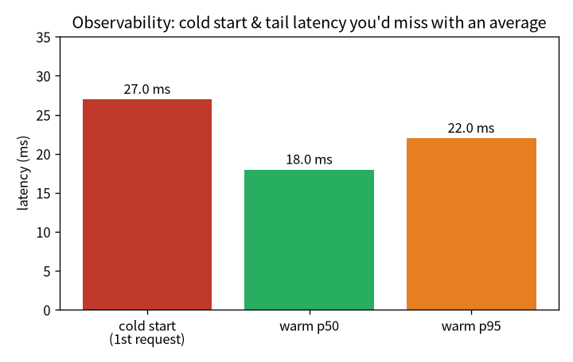

# 服務化與可觀測：從 checkpoint 到能被呼叫的服務 {#sec-serving}

> **一句話**：訓練是「離線、一次性、看 loss」；服務是「線上、持續、面對真實流量」。把模型變成
> **能被呼叫、看得見、量得到**的服務，是 MLOps 的第一關。

```{mermaid}
%%| fig-cap: "你在這裡：踏進第三部（維運／MLOps），把訓好的模型推上線。"
flowchart LR
  A["01 GPT"]-->B["02 零件"]-->C["03 效率"]-->D["04 資料"]-->E["05 評估"]-->F["06 服務"]-->G["07 治理"]-->H["08 漂移"]
  E -.後訓練.-> I["09 對齊"]
  classDef here fill:#c0392b,color:#fff,stroke:#7b241c,stroke-width:2px;
  class F here
```

::: {.callout-note collapse="true"}
## 這章的定位（讀之前先對齊期待）
**假設你已經會**：第 5 章的評估判準。不需要 MLOps / k8s / 容器背景（會用到的概念都會在這裡建立類比）。

**學完你會**：(1) 說清楚服務跟訓練要的東西差在哪（快 / 可觀測 / 可重現）；(2) **逐行**把一個帶
metrics 的最小推論服務建起來；(3) 在**你自己的 CPU 上**親手量到**冷啟動**與**尾延遲 p95**——
體會「你不量就不知道、量了立刻看到」這句可觀測性的核心。本章 💻 配套程式 `tiny_observability.py`
純 CPU、十幾秒、不需語料、不需 GPU。
:::

::: {.callout-tip collapse="true"}
## 🎯 給技術主管：本章關鍵術語速查（懂的人可跳過）
不必親手實作也能跟上——每個術語一句白話 + 為什麼你該在意。

- **推論 API（FastAPI）**：把模型包成可被呼叫的服務。*在意它*：模型要能被產品呼叫才有價值。
- **延遲 / 吞吐（latency / throughput）**：回應多快、每秒處理多少。*在意它*：使用者體感與容量規劃的兩個基本盤。
- **p50 / p95（百分位）**：延遲分布的中位與尾巴。*在意它*：只看平均會把尾延遲藏起來；SLA 該訂在尾巴。
- **冷啟動**：第一個請求特別慢。*在意它*：低流量、剛部署時的體感雷。
- **可觀測性（Prometheus / Grafana）**：自動記錄每個請求的數據。*在意它*：不量就不知道、量了立刻看到。
- **podman pod / 容器**：把服務打包、隔離、可重現部署。*在意它*：通往 k8s 的平滑路徑。
:::

## 服務跟訓練要的東西不一樣

前面五章我們把一個模型訓出來、評估好了。但「訓出一個好模型」和「有一個能上線、能被呼叫、能被
觀測的系統」是兩回事。服務要的東西完全不同——要快、要能被呼叫、要看得到。我把它一層層接起來：

- **推論 API**：用 FastAPI 把模型包成服務，常駐載入 checkpoint 和 tokenizer。端點有 `/health`
  （就緒探針，回模型載好沒、device、參數量）、`/generate`（主端點，回生成文字 + 延遲 + 吞吐）、
  `/metrics`（給 Prometheus 抓）、`/model`（治理，回報自己是哪顆模型——下一章 @sec-governance 詳談）。
- **可觀測性**：Prometheus metrics（請求數、延遲 histogram、生成 token 數）加結構化 JSON 日誌，
  每個請求自動計數、計時、記狀態。
- **容器化**：用 Podman + GPU（透過 CDI passthrough）把服務打包。模型權重用 runtime mount 掛進去、
  跟映像解耦——換模型不用重 build 映像。
- **監控儀表板**：Prometheus + Grafana，用一個 podman pod 把 API、Prometheus、Grafana 三個容器放在
  一起、共享 localhost。

::: {.callout-tip}
## podman pod 就是 k8s「Pod」的微縮版
把多個容器放進一個 pod、共享網路命名空間、互相用 localhost 找得到——這正是 Kubernetes「Pod」概念的
微縮版。單機這樣剛好夠；要多副本、跨機、自動擴縮，才需要真的 k8s。從這裡到 k8s 是一條平滑的路。
:::

## 逐行把一個「會自報 metrics」的服務建起來 {#sec-build-service}

服務的骨架不神祕：**常駐一顆模型 + 每個請求自動記數據**。我們用 `tiny_observability.py` 逐行建出來。

**第 0 步——常駐模型。** 服務啟動時把模型載進記憶體一次，之後每個請求重複用（不要每次都重載）：

```python
class Service:
    def __init__(self):
        self.model = GPT().eval()      # 啟動時載一次，常駐
        self.n_requests = 0
        self.n_tokens = 0
        self.latencies = []
```

**第 1 步——每個請求自動記 metrics。** 處理請求時順手計時、計數、累計 token。可觀測性的精神就是
「把每個請求的事實留下來」：

```python
def generate(self, prompt, n_new=40):
    t0 = time.perf_counter()
    out = self.model.generate(prompt, n_new)
    dt = (time.perf_counter() - t0) * 1000      # ms
    self.n_requests += 1                        # ← /metrics 的 requests_total
    self.n_tokens += n_new                      # ← tokens_generated
    self.latencies.append(dt)                   # ← 算 p50/p95 用
    return out, dt
```

**第 2 步——別只看平均，看百分位。** 平均延遲會被少數慢請求拉歪、也會把尾延遲藏起來。使用者體感
是**尾巴**（p95、p99），所以服務要看百分位：

```python
def pct(xs, p):
    s = sorted(xs)
    return s[min(len(s) - 1, int(p / 100 * len(s)))]
```

## 💻 在你的機器上：冷啟動與尾延遲 {#sec-tiny-observability}

可觀測性最好的學法是親手量一次。配套程式 `tiny_observability.py`（純 CPU、十幾秒、不需語料）把
一顆小模型包成服務、打 30 個請求、印出延遲：

```bash
python tiny_observability.py
```

在我的 Framework 16（純 CPU）上：

```
模型 0.83M，device=cpu

=== 打 30 個請求，看延遲 ===
  冷啟動（第 1 個請求）：  27.0 ms
  暖機後 p50：            18.0 ms
  暖機後 p95：            22.0 ms
  冷/暖倍數：              1.5×

=== /metrics（一裝上就有數據）===
  requests_total      = 30
  tokens_generated    = 1200
  latency_p50_ms      = 18.0
  latency_p95_ms      = 22.0
```

**怎麼讀**：

1. **冷啟動是真的**：第一個請求明顯比之後慢（這裡 CPU 上約 1.5×；原因是 lazy 初始化、執行緒池暖機、
   配置快取）。在 GPU 上更誇張——我在正式服務量到**第一個請求約 354 ms、暖機後約 50 ms**（首次
   呼叫要即時編譯 CUDA kernel）。不管哪種，重點一樣：**量了才知道**。
2. **看尾巴不看平均**：p95（22 ms）比 p50（18 ms）高——使用者體感是尾延遲。只報平均會把這段藏起來。

{#fig-latency width=68%}

::: {.callout-note}
## 可觀測性的價值＝把模糊變事實
@fig-latency 的每一根都是「你不主動量、就只會憑感覺」的東西。可觀測性把「好像第一次比較慢」變成
「冷 27 ms vs 暖 18 ms」、把「大致還行」變成「p95 = 22 ms」。**先有事實，才有得優化、才有得對 SLA 負責。**
:::

## 帶走什麼

- 服務跟訓練要的東西不同：要快、能被呼叫、看得見。推論 API + metrics + 容器 + 儀表板一層層接起來。
- podman pod 是 k8s Pod 的微縮版——單機夠用，要擴縮才上 k8s。
- **可觀測性的核心是把模糊變事實**：冷啟動、尾延遲 p95 都是「不量就不知道、量了立刻看到」。
- 服務只是整條鏈的一段——下一章把它接到**治理**（@sec-governance）：線上這顆到底是哪顆、憑什麼上線。

## 練習 {#sec-serving-exercises}

::: {.callout-note}
## 1（先預測）：把 n_new 加大，冷/暖差距會怎樣？
`tiny_observability.py` 每個請求生成 40 個 token。**先寫下你的預測**：把 `n_new` 加到 200，冷啟動相對
暖機的「倍數」會變大還變小？

::: {.callout-tip collapse="true"}
## 參考答案
通常**倍數變小**——冷啟動的固定開銷（初始化、暖機）被攤平到更長的生成上，佔比下降。這也是為什麼
「冷啟動」在短請求、低流量服務上最有感。動手把 `n_new` 改大，看冷/暖倍數怎麼收斂。
:::
:::

::: {.callout-note}
## 2（動手）：加一個 p99
服務的 SLA 常用 p99。在 `pct` 的基礎上印出 p99，比較 p50/p95/p99。它們的差距告訴你什麼？

::: {.callout-tip collapse="true"}
## 參考答案
p99 通常比 p95 再高一截——尾巴越往後拉越長。p50 和 p99 差很多，代表延遲分布有長尾（少數請求很慢），
這種情況只報平均會嚴重低估使用者最差體感。SLA 訂在 p95/p99 而非平均，正是為了對尾巴負責。
:::
:::

::: {.callout-warning}
## 3（弄壞）：只報平均延遲
把延遲報告改成只印 `mean(latencies)`，把冷啟動那一筆也混進去平均。這會掩蓋掉什麼？

::: {.callout-tip collapse="true"}
## 參考答案
平均會把冷啟動的那一筆大值稀釋進去、也把尾延遲藏起來——你會得到一個「看起來還行」的數字，卻看不到
「第一個請求很慢」和「p95 偏高」這兩個真正影響體感的事實。這就是為什麼可觀測性要看分布（百分位）、
不只看一個總數——又一次「選對指標」。
:::
:::
