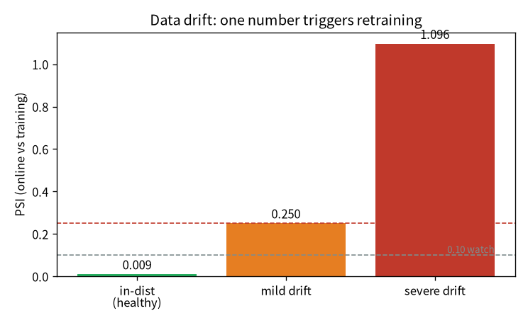

# 會腐壞的系統：drift、重訓、放量 {#sec-drift}

> **一句話**：MLOps 比 DevOps 多兩個變數——**資料**，和**模型會腐壞**。所以模型永遠不算「做完」：
> 世界會漂移，你要持續監控、必要時重訓，而放量的決策又是一個「別用錯指標」的陷阱。

::: {.callout-note}
## 這章的定位（讀之前先對齊期待）
**假設你已經會**：第 7 章的治理與 promotion gate（@sec-governance）、第 5 章「選對指標」。

**學完你會**：(1) 講清楚為什麼模型上線後會「腐壞」、要靠什麼持續顧；(2) **逐行**把 **PSI（資料漂移
指標）** 算出來、設門檻自動觸發重訓；(3) 在**你自己的 CPU 上**親手量 PSI 抓出漂移，並體會放量決策的
坑——**低一致率不一定是壞事**。本章 💻 配套程式 `tiny_drift.py` 純標準庫、不需 torch、瞬間跑完。
:::

## 模型上線不是終點

DevOps 的 ML 版（MLOps）比 DevOps 多了兩個變數：**資料**，和**模型會腐壞（data drift）**。所以模型
永遠不算「做完」——要持續監控、必要時重訓。我做了嬰兒版但完整的迴圈：

| 項 | 做什麼 |
|---|---|
| 漂移監控 | 線上請求分布 vs 訓練分布（OOV + 分箱 PSI），偏離就建議重訓 |
| 重訓迴圈 | 資料→訓練→評估→註冊→gate→promote 的自動外圈，含**回歸檢查**（新模型比現行差就擋下）|
| 金絲雀 / A-B | 同時載兩顆模型、導 N% 流量到候選、按版本分標比較 |
| shadow 比對 | 候選在「影子」裡跟著算同一輸入、回報與現行的一致率（不拖延遲）|
| 量化壓縮 | fp16 / int8，量「大小 vs 品質」的取捨 |

這條外圈跟前一章的 promotion gate 接在一起：漂移觸發重訓 → 訓出候選 → 過 gate（@sec-governance）才
放行。重訓迴圈裡的**回歸檢查**就是 gate 的「沒比現行更好就擋下」。

## 逐行把資料漂移指標（PSI）建起來 {#sec-build-drift}

「模型會腐壞」聽起來抽象，但漂移可以**量化成一個數字**。最常用的是 PSI（population stability index），
我們用 `tiny_drift.py` 逐行把它建出來。

**第 0 步——把分布切成箱、數比例。** 線上請求的某個特徵（這裡用「請求長度」）落進各個區間的比例，
就是它的分布。加一點 Laplace 平滑避免空箱讓對數爆掉：

```python
def histogram(xs, edges):
    counts = [...]                       # 每個區間落幾筆
    tot = sum(counts)
    return [(c + 0.5) / (tot + 0.5 * nb) for c in counts]   # 平滑後的機率
```

**第 1 步——PSI 比兩個分布差多少。** 對每個箱，看「線上比例 vs 訓練比例」差多少、乘上對數比，加總：

```python
def psi(ref, new, edges):
    p_ref, p_new = histogram(ref, edges), histogram(new, edges)
    return sum((pn - pr) * math.log(pn / pr) for pr, pn in zip(p_ref, p_new))
```

**第 2 步——用業界門檻判讀。** PSI 是有公認門檻的：<0.1 穩定、0.1–0.25 留意、>0.25 顯著漂移。
把它接成自動規則，就是「偏離就建議重訓」：

```python
def classify(v):
    return "穩定" if v < 0.1 else "留意" if v < 0.25 else "顯著漂移 → 建議重訓"
```

## 💻 在你的機器上：PSI 抓漂移 + 放量的坑 {#sec-tiny-drift}

配套程式 `tiny_drift.py`（純標準庫、瞬間跑完）模擬「訓練時的請求長度分布」，再丟三種線上情境進去：

```bash
python tiny_drift.py
```

在我的 Framework 16 上：

```
=== drift 監控：PSI（線上請求長度 vs 訓練分布）===
情境                         PSI   判讀
----------------------------------------------------
同分布（健康）                  0.009   穩定（不必動）
輕微漂移（變長一點）               0.250   留意（持續監控）
嚴重漂移（換了流量）               1.096   顯著漂移 → 建議重訓

=== shadow 一致率（候選 vs 現行，同一批輸入）===
  一致率：724/1000 = 72.4%
  低一致率不一定是壞事——更好的模型本來就該跟舊的不一樣。
```

**怎麼讀**：

1. **漂移變成一個數字**：同分布 PSI≈0（穩定）、輕微漂移踩到 0.25 門檻（留意）、嚴重漂移 1.1
   （顯著，建議重訓）。一個數字就能設門檻、自動觸發重訓——不用人盯著看（@fig-drift）。
2. **放量別只看一致率**：候選跟現行只有 72% 一致——但這**不是壞事**。

{#fig-drift width=70%}

::: {.callout-warning}
## 放量決策別只看一個數字
我訓了一顆真候選（8000 步，test_loss 3.46 < 現行 3.70），但它跟現行的輸出一致率只有 **67.5%**。
低一致率「不是壞事」——是它真的學到更好的東西，**更好的模型本來就該跟舊的不一樣**。所以放行的硬條件
是「品質 gate（更好就放行）」，一致率只告訴你「改動多大、要多謹慎驗」。把一致率當硬門檻，會擋掉每一次
真進步。這又是一個「選對指標」的例子（呼應 @sec-eval）。
:::

## 帶走什麼

- 模型會腐壞，所以永遠不算「做完」：要持續監控（drift）+ 必要時重訓。
- **漂移可量化**：PSI 把「線上 vs 訓練」變成一個數字、設門檻自動觸發重訓。
- 重訓迴圈 + 回歸檢查 + canary/shadow 把「換模型」變成可控、可比較、可回退的流程，接回上一章的 gate。
- **放量決策的硬條件是品質 gate，別把「改動幅度（一致率）」當門檻**——那會擋掉每一次真進步。

## 練習 {#sec-drift-exercises}

::: {.callout-note}
## 1（先預測）：把線上分布調回跟訓練一樣，PSI 會怎樣？
`tiny_drift.py` 的「嚴重漂移」用 `mean=32`。**先寫下你的預測**：把它改回 `mean=25`（跟訓練一樣），
PSI 會落在哪一檔？

::: {.callout-tip collapse="true"}
## 參考答案
PSI 會掉到接近 0（「穩定」）——兩個分布幾乎一樣，逐箱比例差≈0。剩下的一點點是抽樣雜訊。這也說明
PSI 的門檻（0.1 / 0.25）是為了把「雜訊」和「真漂移」分開——跟第 5 章「先有雜訊尺度再判顯著」同一個思路。
:::
:::

::: {.callout-note}
## 2（動手）：換一個漂移特徵
PSI 量的是任一個分布。把「請求長度」換成別的特徵（例如 OOV 比例、某類請求佔比），重算 PSI。
不同特徵會抓到不同的漂移嗎？

::: {.callout-tip collapse="true"}
## 參考答案
會——漂移可能只出現在某些特徵上（例如長度沒變、但主題分布變了）。所以真實監控會同時盯**多個**信號
（OOV + 多個分箱 PSI），任一個越線就示警。單一指標會漏掉它沒在看的那種漂移——又是「選對（夠多）指標」。
:::
:::

::: {.callout-warning}
## 3（弄壞）：把「一致率」當放量硬門檻
假設你規定「候選跟現行一致率要 ≥ 95% 才放量」。用 `tiny_drift.py` 那個 72% 一致率的候選，會發生什麼？

::: {.callout-tip collapse="true"}
## 參考答案
它會被擋下——即使它在品質 gate 上其實更好。**把一致率當硬門檻，等於規定「新模型必須跟舊的幾乎一樣」，
那就擋掉了每一次真進步**。一致率該當「改動多大、要多謹慎驗」的參考，放行的硬條件是品質 gate。
這正是本章最重要的「選對指標」：用錯尺，你會把進步當成風險擋掉。
:::
:::
