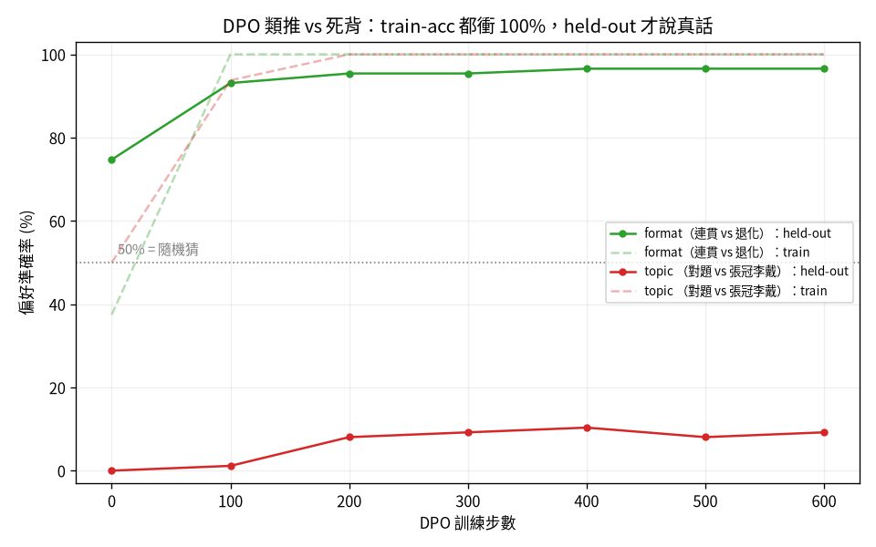
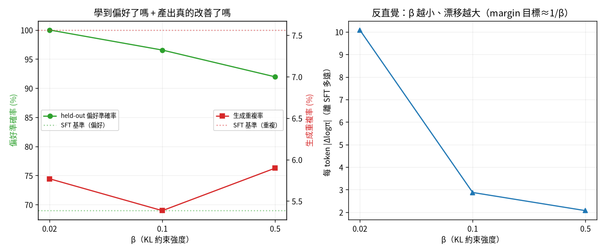
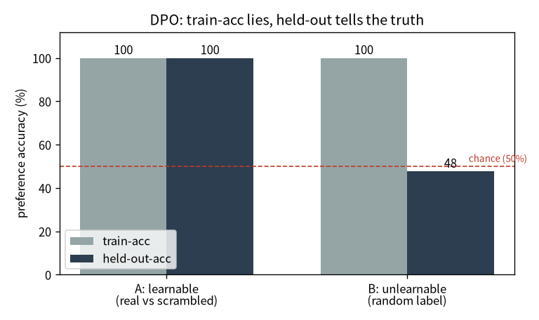
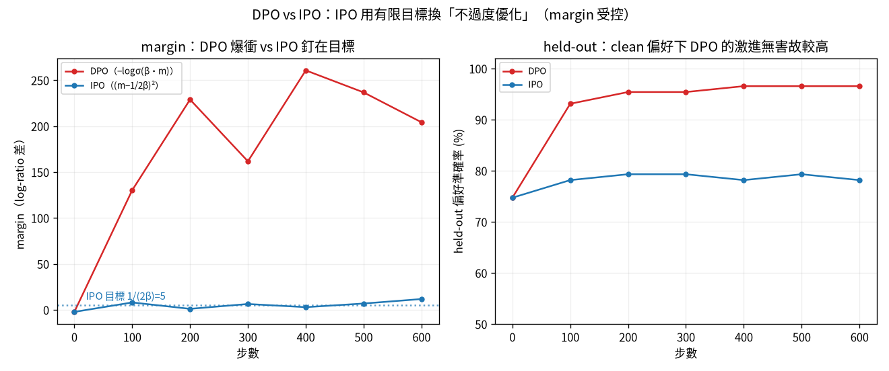
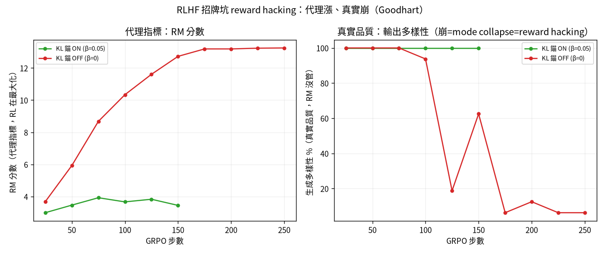
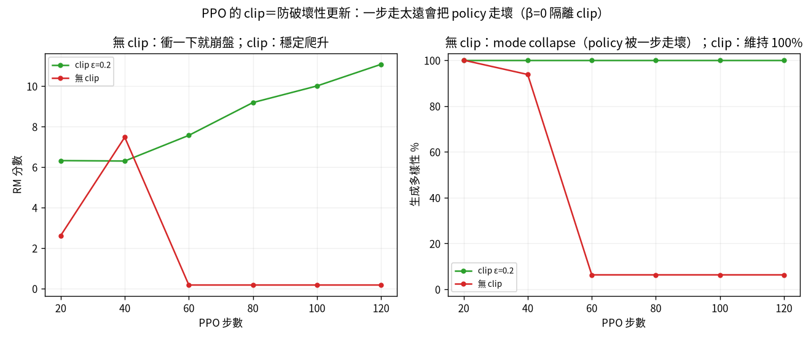

# 對齊：把「接龍機器」教成「會聽話、有偏好」 {#sec-alignment}

> **一句話**：預訓練只會「猜下一字」。後訓練把它對齊成助理——而每一種對齊方法，都有一個
> 漂亮的機制和一個會咬人的坑。

我把對齊的兩個家族都親手走過：**偏好優化**（DPO → IPO）和 **RL 對齊**（GRPO → PPO），
每個都有對照實驗。這一章是整本書的皇冠。

```{mermaid}
%%| fig-cap: "你在這裡：皇冠——把「接龍機器」對齊成會聽話、有偏好的助理。"
flowchart LR
  A["01 GPT"]-->B["02 零件"]-->C["03 效率"]-->D["04 資料"]-->E["05 評估"]-->F["06 服務"]-->G["07 治理"]-->H["08 漂移"]
  E -.後訓練.-> I["09 對齊"]
  classDef here fill:#c0392b,color:#fff,stroke:#7b241c,stroke-width:2px;
  class I here
```

::: {.callout-note}
## 這章的定位（讀之前先對齊期待）
**假設你已經會**：第 1 章的小 GPT 與「預測下一字」的訓練、第 5 章「選對指標／看 held-out」的紀律。
不需要任何 RLHF 背景。

**學完你會**：(1) 用一句話講清楚 SFT / DPO / IPO / GRPO / PPO 各自的**漂亮機制**與**會咬人的坑**；
(2) **逐行**把 DPO 損失從「序列對數機率」建起來，並說清楚 `margin`、`β`、`logsigmoid` 各做什麼；
(3) 在**你自己的 CPU 上**親手重現本章最重要的一課——**train-acc 衝 100%、held-out 才說真話**。
本章的 💻 配套程式 `tiny_dpo.py` 完整內嵌、純 CPU 兩三分鐘可跑。
:::

::: {.callout-tip collapse="true"}
## 🎯 給技術主管：本章關鍵術語速查（懂的人可跳過）
不必親手實作也能跟上——每個術語一句白話 + 為什麼你該在意。

- **SFT（指令微調）**：教模型「會聽話、照問答格式回應」。*在意它*：從「接話機器」變「助理」的第一步。
- **偏好優化（DPO / IPO）**：用「一好一壞」的比較教模型偏好。*在意它*：免 reward model 的對齊捷徑。
- **reference model / KL 錨**：把新模型綁在舊模型附近。*在意它*：防止對齊把模型帶歪（過度優化）。
- **RLHF（reward model / GRPO / PPO）**：用「學來的獎勵」做強化學習。*在意它*：ChatGPT 那套對齊的家族。
- **reward hacking / Goodhart**：指標一旦變成目標就被鑽。*在意它*：對齊最有名的坑——代理分數暴漲、真實品質崩。
- **train-acc 騙你 / 看 held-out**：訓練分數高 ≠ 真學會。*在意它*：跟第 5 章同一條鐵則。
:::

## SFT：從「會接話」到「會聽話」

第一步 SFT（指令微調）很單純：在「問：…答：…」的對話格式上續訓，模型的行為就從「續寫維基」
變成「在『答：』的位置產生回應」。

但**評估**它馬上踩到第 5 章那個坑的進階版：用維基 perplexity 量，SFT 看起來變爛了。真相是
尺被汙染（alignment tax + gold 答案洩漏進預訓練）。改量「應答行為率」，base 29% → SFT 72%——
**選對指標，結論才對。**

## DPO：免 reward model 的捷徑，與它的封閉式 {#sec-build-dpo}

DPO（直接偏好優化）給一組「同一個問題、一好一壞」的回答，用一條封閉式損失直接優化偏好，
不需要訓練 reward model、也不需要 RL。我們從**一個序列的對數機率**這個積木開始，一步一步
把這條損失建起來——這就是 `tiny_dpo.py` 裡 `dpo_loss` 的逐行拆解。

**第 0 步——一段序列的對數機率。** 模型對「下一字」給機率；把一整段回答每個位置的
log p(token｜前文) 加起來，就是「這個模型有多想生出這段話」的分數：

```python
def seq_logprob(model, seq):
    logits = model(seq[:, :-1])                 # 每個位置對下一字的分數
    logp = F.log_softmax(logits, dim=-1)
    tgt = seq[:, 1:].unsqueeze(-1)              # 真正的下一字
    return logp.gather(-1, tgt).squeeze(-1).sum(dim=1)   # Σ_t log p：整段的對數機率
```

**第 1 步——policy 相對 reference 漲了多少。** 我們不看「絕對機率」，看「**相對凍結的
reference（=SFT 後、還沒做偏好優化的那顆）漲了多少**」。對 chosen 算一次、rejected 算一次：

```python
pol_ch,  pol_rej  = seq_logprob(model, chosen), seq_logprob(model, rejected)
ref_ch,  ref_rej  = seq_logprob(ref,   chosen), seq_logprob(ref,   rejected)
```

**第 2 步——margin：chosen 比 rejected 多漲多少。** 把兩邊的「相對 reference 漲幅」相減。
margin > 0 就代表「policy 把 chosen 推得比 rejected 高」，也就是偏好排對了：

```python
margin = (pol_ch - ref_ch) - (pol_rej - ref_rej)
```

**第 3 步——把 margin 推大的損失。** 用 `logsigmoid` 把 margin 變成損失：margin 越大、損失越小。
`β` 是溫度，控制「推多用力 / 離 reference 多遠」（β 的反直覺行為見 @sec-margin-math）：

```python
loss = -F.logsigmoid(beta * margin).mean()      # 拉高 chosen、壓低 rejected
acc  = (margin > 0).float().mean()              # margin>0 的比例 = 偏好排對率
```

把四步拼起來就是完整的 `dpo_loss`——**沒有 reward model、沒有 RL，就一條可微的損失**：

```python
def dpo_loss(model, ref, chosen, rejected, beta):
    pol_ch,  pol_rej  = seq_logprob(model, chosen), seq_logprob(model, rejected)
    ref_ch,  ref_rej  = seq_logprob(ref,   chosen), seq_logprob(ref,   rejected)
    margin = (pol_ch - ref_ch) - (pol_rej - ref_rej)
    loss = -F.logsigmoid(beta * margin).mean()
    acc  = (margin > 0).float().mean()
    return loss, acc.item()
```

這條式子不是憑空來的，是從 RLHF 的目標推出來的，而且推導裡有個漂亮的「配分函數相消」——
本來 RLHF 要先學 reward、再用 RL 去最大化它，DPO 證明這兩步可以**合併成上面這一條損失**
（完整證明見 @sec-dpo-math）。

### 死背 vs 真學：train-acc 會騙你

我設了兩種偏好軸——一種模型容量內、一種超出容量——然後看它們類推得如何：

{#fig-dpo-gen width=85%}

::: {.callout-warning}
## 看 held-out，不要看 train
@fig-dpo-gen 裡兩條 train 線（虛線）都衝到 100%——只看 train 你會說「兩個都學會了」。但 held-out
（實線）一個 97%、一個只有 9%。後者需要「標題↔內容」的語義綁定，8M 模型學不動、只能把訓練題
**背起來**。**這是 MLOps 鐵則：看 held-out、別看 train。**
:::

### 精修 β：一個被資料打臉的直覺

DPO 唯一的旋鈕是 β。教科書直覺是「β 大＝KL 罰得重＝貼緊 reference」。我掃了 β，結果**固定步數下
剛好相反**——β 越小，policy 漂移越大（為什麼見 @sec-margin-math）。

{#fig-beta width=85%}

## 💻 在你的機器上：親手看 train-acc 怎麼騙你 {#sec-tiny-dpo}

圖會說話，但自己跑過一次更難忘。配套程式 `tiny_dpo.py` 把上面那條 `dpo_loss` 接到第 1 章的
char-level 小 GPT 上，**純 CPU、兩三分鐘**，讓你親手重現 @fig-dpo-gen 的那一課。

它先在莎士比亞上預訓練一顆 base 當 reference，複製一份當 policy，然後設**兩種偏好軸**做 DPO：

- **A 軸（可學）**：chosen = 真實片段、rejected = 把同一段**字元順序打亂**。「真的比亂的好」是個
  有語義的通則 → 模型該能**類推**到沒看過的片段。
- **B 軸（學不動）**：chosen / rejected 都是真實片段，誰是 chosen 用**擲硬幣亂指**。這規則沒有
  任何語義、無從類推 → 模型只能把訓練題**背起來**。

```bash
curl -o input.txt https://raw.githubusercontent.com/karpathy/char-rnn/master/data/tinyshakespeare/input.txt
python tiny_dpo.py
```

在我的 Framework 16（純 CPU）上跑出來：

```
偏好軸                               train-acc  held-out-acc
---------------------------------------------------------
A 可學（真實 vs 打亂）                       100.0%        100.0%
B 學不動（隨機標籤）                          100.0%         47.7%
```

**怎麼讀**：兩軸的 **train-acc 都是 100%**——只看 train，你會宣稱「兩個都學會了」。但 held-out
說了真話：A 軸 100%（真的學到「真>亂」這個通則、能類推），B 軸掉回 **47.7%≈擲硬幣**（規則無從
類推，100% 只是死背訓練題）。這跟 @fig-dpo-gen 的容量內 vs 容量外是同一個形狀，只是縮到你的
筆電上、兩三分鐘就親眼看到（@fig-dpo-tiny）。

{#fig-dpo-tiny width=72%}

::: {.callout-important}
## 這就是 MLOps 鐵則的最小可重現版
**train 上漂亮的數字，可能只是背起來。** 衡量「有沒有真學會」的唯一誠實方式是看 **held-out**。
這條鐵則在 DPO 如此、在你日後任何模型都如此——這也是為什麼第 5 章要花整章講「質疑你的尺」。
:::

## IPO：把「margin 推到無窮」改成「回歸固定目標」

DPO 的 logistic 損失飽和後梯度雖小卻永不歸零 → margin 被一路推爆 → 過度優化。IPO 改用平方損失
$(m-\frac{1}{2\beta})^2$，給 margin 一個**有限目標**，到了就停。

{#fig-ipo width=85%}

::: {.callout-tip}
## 防過度優化的工具不是「無腦更好」
@fig-ipo 右圖：clean 偏好上 IPO held-out 78% < DPO 97%。IPO 拿準度換穩定，它的勝場在「過度優化
會傷」的場景（偏好含雜訊時 DPO 會死記）。**煞車是保險，不是免費的。**
:::

## RLHF 之一 — GRPO，與招牌坑 reward hacking

DPO 把 reward 隱含在 policy 裡；RLHF 把它做成一顆**獨立的 reward model**，再用 RL 去最大化它。
我用 GRPO（DeepSeek，不需 critic）做，並刻意演示對齊最有名的坑：

{#fig-hack width=85%}

::: {.callout-important}
## Goodhart：指標一旦變成目標，就不再是好指標
@fig-hack：拿掉 KL 錨，policy 把 RM 分數從 3.7 衝到 **13.2**，輸出卻 collapse 成「不管問什麼都吐
同一串高分垃圾」（多樣性 100%→6%）。那串垃圾落在 RM 訓練分布外、被誤判高分——policy 鑽了漏洞。
這和稽核裡「KPI 被優化就造假」是同一回事。防法＝**KL 錨**把 policy 綁在可信舊模型附近。
:::

## RLHF 之二 — PPO，與 GRPO 簡化掉的兩塊

把 GRPO 的精簡還原回 PPO（InstructGPT 用的經典），就看得到 GRPO 丟掉了什麼：

| 零件 | PPO 有 | GRPO 怎麼省 |
|---|---|---|
| Critic（value 網路）| 學一個基準 $A=R-V(x)$ | 用「同組 K 個回答的平均」當基準 |
| Clipped surrogate | ratio 夾在 $[1\pm\epsilon]$、可重用 rollout 多 epoch | 一批只訓一次，不需要 |

{#fig-ppo width=85%}

@fig-ppo（為了隔離 clip，刻意關掉 KL 罰）：無 clip 時某一步把 policy 推太遠 → 直接走崩
（多樣性 100%→6%、RM 7.5→0.2）；clip 把 importance ratio 夾住 → 穩定改進。這就是 PPO 名字裡
**Proximal（近端）** 的意義：逼新 policy 待在舊的附近。

## 帶走什麼：一條貫穿四種方法的主線

| 方法 | 漂亮的機制 | 會咬人的坑 |
|---|---|---|
| SFT | 學會應答格式 | 評估的尺被汙染 |
| DPO | 配分函數相消、免 RL | train-acc 騙你（死背 vs 真學）|
| IPO | margin 有限目標、防過度優化 | 不是無腦更好（拿準度換穩定）|
| GRPO | 不需 critic | reward model 被 hack（Goodhart）|
| PPO | clip 防破壞性更新 | 要隔離一個機制得先關掉會蓋過它的另一個 |

> 五個方法，五次「換把尺、結論就翻」。**永遠質疑你的指標有沒有被汙染或被鑽**——這比任何單一方法都重要。

## 練習 {#sec-ch7-exercises}

::: {.callout-note}
## 1（先預測）：把 reference 拿掉會怎樣？
DPO 的 `margin` 是「policy 相對 **reference** 的漲幅」之差。**先寫下你的預測**：如果把 `dpo_loss`
裡的 `ref_ch`、`ref_rej` 都當成 0（等於沒有 reference 錨），訓練會怎麼變？

::: {.callout-tip collapse="true"}
## 參考答案
少了 reference 這個錨，損失只剩「把 chosen 的絕對對數機率推高、rejected 推低」，policy 會更不受
約束地漂移、更容易過度優化（把整個分布往訓練偏好硬拉），也更可能把無關的東西一起帶歪。
reference 項的作用正是 @sec-margin-math 講的 KL 錨——它把「漲幅」而非「絕對機率」當目標，
讓 policy 待在可信舊模型附近。動手把 `ref_*` 設 0 跑一次，對照 held-out 與生成樣本。
:::
:::

::: {.callout-note}
## 2（動手）：掃 β
在 `tiny_dpo.py` 把 `beta` 從 0.1 改成 0.02 和 0.5 各跑一次，記錄 A/B 兩軸的 train/held-out acc。
β 變大、變小，分別怎麼影響「學得多快 / 漂移多遠」？對照 @fig-beta。

::: {.callout-tip collapse="true"}
## 參考答案
固定步數下，**β 小反而漂移更大**（見 @sec-margin-math 的反直覺結果）——這跟教科書「β 大＝罰得重＝
貼緊 reference」的直覺一致，但要小心「固定步數」這個前提。A 軸（可學）通常各 β 都能類推到 held-out；
B 軸（學不動）不管 β 怎麼調，held-out 都停在擲硬幣附近——**煞車調得再好，學不動的東西還是學不動。**
:::
:::

::: {.callout-warning}
## 3（弄壞）：把 B 軸的「隨機標籤」改成「可學規則」
B 軸現在用擲硬幣指定 chosen。把它改成一條**有語義、模型學得動**的規則（例如「chosen = 兩段中
較長的那段」），重跑。held-out 會怎麼變？

::: {.callout-tip collapse="true"}
## 參考答案
held-out 會從 ~50% 爬上去——因為「比較長」是個 8M 模型也能從序列長度線索學到、且能類推的通則。
這直接證明剛才的 47.7% **不是 DPO 壞了**，而是那條規則本身無從類推。**同一套損失，換個學得動的
偏好軸，held-out 就說真話了**——再次呼應「問題常在尺/任務、不在方法」。
:::
:::
