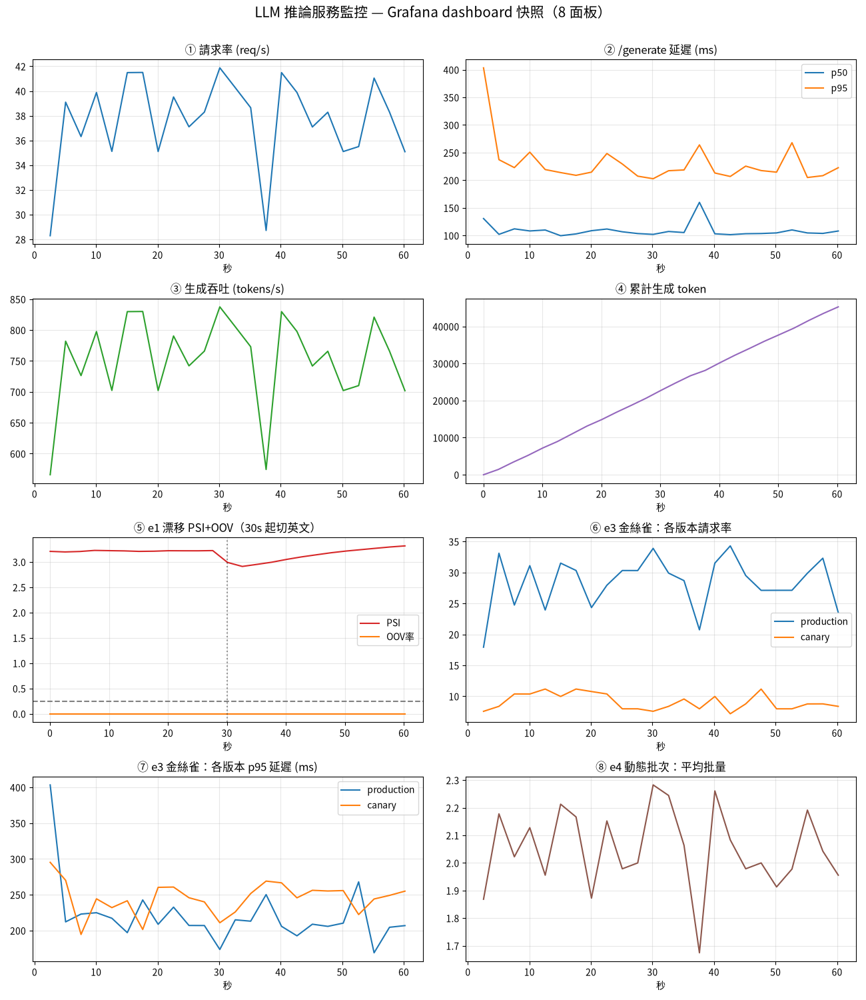

# 從零打造一個 LLM，並把它一路推到「能上線、能治理」

> 一句話：我手刻了一個 decoder-only GPT，然後把它走完一遍真實 MLOps——
> 資料工程、現代架構、訓練評估、線上服務、可觀測性、容器化、監控儀表板、模型治理。
> 重點不是「做出一個小模型」，而是**過程中的工程判斷與方法論**：每個技巧都「先預測再實測」，
> 每個指標都「先講判準再驗證」，每個假設都「量過才信」。

公開原始碼：<https://github.com/ryanGTR/llm-from-scratch>（MIT、CI 綠、可重跑）

---

## 為什麼做這個

我是銀行 IT 出身，熟治理、合規、平台。但 LLM 對我一直是黑盒。與其追工具，我決定
**從零把一個 GPT 刻出來、再用我熟悉的工程/治理視角把它工業化**——這樣我同時補上
「ML 內部原理」與「ML 系統工程」兩塊，而它們的交集（MLOps + 模型治理）正是我想長期經營的位置。

---

## 整條旅程

```
搞懂原理 → 工程化 → 真實規模資料 → 訓練+嚴謹評估 → 部署 → 治理
```

| 階段 | 做了什麼 | 帶走的能力 |
|---|---|---|
| 原理 | 手刻 self-attention / multi-head / causal mask / residual / 自回歸生成 | 看得懂 Transformer 內部，不是調 API |
| 現代化 | 一鍵切換 RMSNorm / SwiGLU / RoPE / GQA / FlashAttention / KV-cache（LLaMA 同款） | 知道每個現代零件「優化的是準還是省」 |
| 資料工程 | 105 MB 中文維基實戰：清洗 / LSH 去重 / 品質偵測器報表 | 真實規模、真實語言的資料品質工程 |
| 訓練/評估 | 現代架構訓練 → 對「事先講好的判準」逐項驗證 | 嚴謹、不移動球門的評估紀律 |
| 部署 | FastAPI 推論服務 + Prometheus/Grafana 可觀測性 + Podman GPU 容器 | 把模型變成線上服務 |
| 治理 | digest 身份 + registry + lineage + model card + promotion gate | 模型上線的稽核與控制 |

---

## 三個讓我印象最深的「假設被打破」

真正學到東西的地方，往往是「以為對、結果錯」的瞬間。

### 1. 「現代技巧一定更好」——錯，要看它優化的是「準」還是「省」
RMSNorm 換上去 loss 幾乎沒變——因為它優化的是**成本**（同準、更省），不是準度。SwiGLU / RoPE
才降 loss。評估任何新技巧前，先問它在「準 vs 省」哪一軸。我還用多 seed（mean ± std）確認
SwiGLU/RoPE 的改善是雜訊的 11–22 倍 = 真差異，而不是抽樣運氣。

### 2. 「KV-cache 一定更快」——錯，看 regime
KV-cache 在 CPU 長生成快 2.2×，但在我的 **GPU + 小模型 + 短生成** 反而**慢 18%**——一次只算
一個 token 浪費了 GPU 的平行度，per-step 開銷超過省下的重算。教訓：「省」的技巧是否真省，
**要量你自己的 workload，別照搬論文結論**。

### 3. 「聚合指標說健康就健康」——錯，一定要看資料
換成中文維基後，熵/壓縮/重複率全部顯示「健康 ✅」。但我做了一套**資料品質偵測器**去掃，
抓到 **21.6% 的文件**殘留維基的繁簡轉換語法 `-{zh-tw:..;zh-cn:..}-`——這是任何聚合指標都
看不到、只有「真的去看樣本 + 把問題寫成偵測器」才現形的。修一條清洗規則，21.6% → 0.05%，
我用監控面板的 before/after 對照圖留下視覺證據。

---

## 資料工程：真實規模 + 真實語言

把玩具級的 1 MB 英文，換成 105 MB 中文維基後，原本的 pipeline 假設一個個破：

- **去重**用「空白切詞」做 shingle → 中文沒空白會失效 → 改**字元 n-gram**。
- **兩兩比對 O(n²)** → 11k 篇純 Python 跑不動 → 加 **MinHash + LSH**，21.6 秒去完、抓 161 篇近似重複。
- **熵門檻**是英文校準的（3.5–6）→ 中文 9.70 被誤判 → 改**熵效率（熵 / log2 vocab）**，跨語言通用。

我還把「看資料」工業化成**偵測器報表系統**（掃全語料、量化、設門檻 = 資料 gate），
心法是「看樣本發現問題 → 寫成一條偵測器 → 累積成資料的測試套件」——和稽核控制項一條條疊上去
是同一個思路。

---

## 訓練與評估：先講判準，再驗證

訓練前先寫死「什麼叫成功」，訓完逐項對，不事後找理由：

| 判準 | 結果 |
|---|---|
| 有沒有在學（vs 亂猜基準 ln(14210)=9.56） | 9.59 → val 3.67 ✅ |
| 會不會類推（test ≈ val？） | test 3.695 ≈ val 3.677（gap 0.018）✅ |
| 學了多少（BPC vs 無條件熵 9.70） | 5.33 bits/char（靠上下文砍 45%）✅ |
| 像不像中文（質性） | 真詞/語法/標點對，整體不連貫=小模型水準 ✅ |

---

## 部署與治理：把我的本行接上 ML

這是我最想經營的一段——把企業 IT 的治理視角接到模型上。



- **推論服務**：FastAPI（`/health` `/generate` `/model` `/metrics`），KV-cache 路徑可切換。
- **可觀測性**：Prometheus metrics（請求率 / 延遲 histogram / token）+ 結構化 JSON 日誌；
  一裝上就抓到**冷啟動**（首個請求 354ms、暖機後 50ms）。
- **容器化**：Podman + GPU（CDI passthrough）、模型 runtime mount 與映像解耦。
- **監控儀表板**：Prometheus + Grafana，用一個 podman pod 把三個容器放一起共享網路——
  正是 k8s「Pod」概念的微縮版。
- **模型治理**：模型身份用 **ckpt 的 sha256 digest**（像 container image digest / cosign，不靠檔名）；
  registry 台帳綁 lineage（資料 digest + 品質 gate + git commit）；每顆產 model card；
  **promotion gate** 沒過資料品質 + 評估就擋下上線；服務端 `/model` 回報自己的 digest，
  確認線上跑的是不是被批准的那顆（`UNREGISTERED` = 稽核紅旗）。

---

## 這個專案「不是」什麼（誠實的範圍）

- **不是** ChatGPT。模型只有 ~8M 參數、char-level、單機規模——它學會中文的字、詞、語法、
  標點，但寫不出連貫文章。能力上限受限於規模與資料，這我從頭就講清楚。
- 價值**不在模型本身**，在於**走完整條鏈時的工程判斷與方法論**：可重現（uv lock）、
  可驗證（單元測試 + 驗收 playbook + CI）、可觀測、可治理。

---

## 技術棧

Python · PyTorch（自刻模型）· NumPy（向量化 MinHash/LSH）· FastAPI · Prometheus · Grafana ·
Podman（GPU via CDI）· uv（鎖依賴）· GitHub Actions（CI）· Jupyter（監控面板）

## 一句話總結

> 我沒有「用」一個 LLM，我把一個 LLM **從零養大、送上線、再管起來**——
> 而且每一步都先預測、先講判準、先量測，再下結論。
