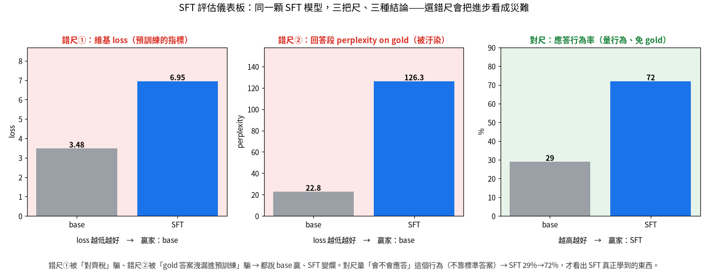

# 關鍵時刻：那些「以為對、結果錯」的瞬間

這個專案真正的價值不在模型（它是玩具），在**過程中的工程判斷**。而判斷力長得最快的地方，
都是「以為對、量了才發現錯」的那一刻。這頁把它們記下來——尤其是最關鍵的那一個。

---

## ⭐ 關鍵的一刻：SFT 評估的兩個陷阱（2026-06-21）

做完 SFT（指令微調）後，要驗「它有沒有變好」。我連續踩了兩個陷阱，第二個連我自己都差點被騙。

**陷阱①——用「預訓練的尺」量 SFT**
維基 loss：base 3.48 vs SFT 6.95。SFT「看起來」爛了兩倍。
真相：這叫 **alignment tax（對齊稅）**——模型往「對話應答」偏，自然就比較不會「預測純維基文」。
用預訓練的尺量後訓練，必然誤判。

**陷阱②——連「回答段 loss」都被汙染**
我以為「只算答案 token 的 loss」總公平了吧？結果 base perplexity 22.8 vs SFT 126，base 又贏、
SFT win-rate 0%。
想清楚才發現：held-out 的「標準答案」就是維基定義句，而 **base 預訓練時親眼看過這些句子**——
所以它對 gold 答案 loss 低，不是因為它「會應答」，是因為它「背過」。SFT 微調時把特定知識
blur 掉了（對齊稅），對特定 gold 反而更差。**答案洩漏進了 base 的預訓練**，這把尺從根本不公平。

**正解——量「行為」，不量「背特定答案」**
改問「生成出來的回答，是不是以定義句應答」（純看行為、不靠 gold）：base 29% → SFT 72%。
SFT 真正學到的「會應答」這個行為，這把尺才照得出來。

### 這一刻的教訓（核心方法論）

> **同一顆模型，量的尺不同，結論可以完全相反。選對指標，比把數字做漂亮重要得多。**

而且：**「看起來最合理」的指標也會騙人**（回答段 loss 看似公平，卻被資料洩漏汙染）。驗證時要先問
這把尺「到底量到什麼、有沒有被汙染」，而不是急著看數字大小。這是評估的真功夫。

---

## ⭐ 關鍵的一刻：DPO「死背 vs 真學」——train-acc 100% 全是假象（2026-06-21）

做 DPO（後訓練里程碑2）時，設計了兩種偏好軸，本來只想示範機制，卻量出整個專案最乾淨的
一張「過擬合 vs 類推」對照：

- **format 軸**（連貫定義 vs 退化重複迴圈）：held-out 偏好準確率 SFT 69% → **DPO 97%**。
- **topic 軸**（對題定義 vs 張冠李戴，主詞對、內容是別條目的）：held-out SFT 0% → DPO **只 9%**。

但**兩種軸的 train-acc 都在第 200 步就衝到 100%**。如果只看 train，會宣稱「DPO 兩種都學會了」
——完全錯。held-out 才說真話：format 真的學到「避免退化」這個可遷移特徵；topic 需要「標題↔內容」
的語義綁定，8M char 模型沒這個容量，只能把 784 組訓練對**背起來**，對沒見過的題等於亂猜。

### 這一刻的三個教訓

1. **看 held-out，不要看 train**（MLOps 鐵則）。所以 `06_dpo.py` 直接把 held-out 偏好率記進
   訓練曲線、`eval_dpo.py` 畫成圖——讓「死背」無所遁形。
2. **又一次選錯尺**：一開始用「總和 logπ」比 chosen/rejected，SFT 基準量到 0%（看起來像「模型
   完全相反」）。其實是**長度偏誤**——chosen 較長、總和較負就輸了。改用「每 token 平均 logπ」
   才量到內容。**和 SFT 評估同一個病：尺被汙染**。
3. **fluency ≠ correctness**：base 模型覺得「通用但跑題」的定義比「具體但正確」的更順（per-token
   機率更高）——topic 軸要模型違背語言機率先驗去偏好正確內容，這對小模型是 hard mode。
   →「對齊」之所以難，正因為「好」常常不是「機率高」。

> 這也劃清了「機制 vs 能力」：DPO 的**機制**完全跑通（loss 數學有單元測試守、format 軸真類推）；
> 但**能力**受 8M 規模限。想讓 topic 軸也學得會，靠的不是更好的 DPO，是更大的模型/資料。

---

## 其他「假設被打破」的時刻（同一個形狀：假設 → 量了 → 修正）

| 假設 | 量了發現 | 修正 / 教訓 |
|---|---|---|
| DPO train-acc 100% = 學會了 | held-out 一邊 97% 一邊只 9% | 看 held-out 不看 train；容量內才類推、超出只背 |
| β 大＝KL 罰得重＝緊貼 reference | 固定步數下 β 越小漂移越大（margin≈1/β）| 小 β 不是更保守是更激進；連我畫圖的標題都先寫反、被資料打臉 |
| 現代技巧一定更好 | RMSNorm 換上去 loss 沒變 | 先問它優化「準」還是「省」（RMSNorm 是省、SwiGLU/RoPE 是準）|
| KV-cache 一定更快 | GPU + 小模型 + 短生成反而慢 18% | 「省」的技巧是否真省看 regime，量你自己的 workload |
| 聚合指標說健康就健康 | 熵/壓縮都 ✅，卻 21.6% 文件有維基語法 | 聚合指標必要但不夠，一定要看樣本；把問題寫成偵測器 |
| 英文 pipeline 套中文能用 | 空白切詞去重失效、熵門檻誤判 | 字元 n-gram + LSH、熵效率——跨語言別照搬假設 |
| 服務只要比效能 | 沒驗批次/金絲雀的「輸出正確性」 | 驗不變量（合批==單獨）+ shadow agreement |
| 低 agreement = 壞候選 | 真正更好的 8000 步候選 agreement 只 67.5% | agreement 是「改了多少」不是「好不好」；更好的模型本該不一樣 |
| SFT 變好用 loss 量得出 | 被對齊稅 + gold 洩漏連騙兩次 | 量「行為」不量「背特定答案」（見上）|

---

## 一句話總結

這串教訓有一個共同的形狀：**先講判準 → 親手量 → 量了才發現假設錯 → 修正並理解為什麼**。
模型會過時，這個「不靠直覺、靠量測、而且會質疑自己那把尺」的紀律不會。這才是這個專案真正的產物。
